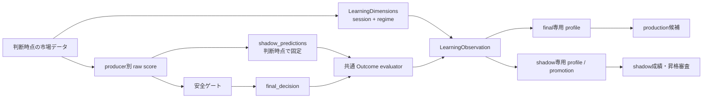

# B. 学習の「軸」と「還流」の設計

## 実装状態（2026-07-17）

Phase B1〜B4 を実装済み。セッション・レジーム別係数は設計どおり観測専用で、
自動的に production 判断を変更しない。shadow producer の成績は完全判断ログから
派生した版付き outcome を優先して promotion へ渡し、利用できない旧ログだけ
従来の固定ホライズン採点へフォールバックする。

## 1. 結論

B は、判断時点の市場文脈を共通スキーマへ載せ、最終判断とは別の
`shadow_hypothesis` を独立採点することで解決する。

1. 市場時間は `session_bucket` というカテゴリ特徴量として記録する。
   東京、ロンドン、ニューヨーク、東京・ロンドン重複、ロンドン・NY重複、
   主要時間外、休場を、IANA タイムゾーンを使って判断する。
2. 市場レジームは表示用文字列のままにせず、判断時点の
   `regime`、`regime_source`、`regime_schema_version` を学習次元へ保存する。
3. 中立・イベント待ち・品質不足・期待値ガード中でも、判断前に存在した
   raw score から shadow 仮説を作る。未来データで後付け生成してはならない。
4. 最終判断と shadow 仮説はラベル、集計、昇格状態を分離する。
   shadow の結果はまず shadow 専用セルと委員昇格へ還流し、
   production の重みや安全ゲートを直接変更しない。
5. 初期版の自動調整は既存どおり全体統計を主とする。セッション別・
   レジーム別は観測から始め、実効サンプルと OOS ゲートを満たした軸だけを
   全体値へシュリンクした候補として昇格させる。

この設計で「見送ったため永久に正誤が分からない」という凍結を解く一方、
見送り理由を無効化した売買提案が本番判断へ混ざることを防ぐ。

## 2. 現状の断線

### 2.1 市場時間

`fx_intel.market` は週末の開閉判定だけを持つ。判断時刻はログにあるが、
東京・ロンドン・NY のどの参加者が中心だったかは特徴量にも集計軸にもない。
同じテクニカル条件でも流動性、スプレッド、ニュース反応が異なる時間帯を
同じ母集団として学習している。

### 2.2 shadow 仮説

`committee.py` は macro / ML の shadow score を `features` に残し、
`promotion.py` はその符号を固定ホライズンで採点できる。ただし、次が不足している。

- 最終 composite の「閾値未満だった方向仮説」が独立した予測として残らない。
- 予測 ID、モデル版、閾値、ブロック理由、予測時の stage が一つの契約になっていない。
- 固定ホライズン終値による方向採点と、D で定義した canonical Net R が接続していない。
- shadow 成績をセッション・レジーム別に追跡できない。
- 最終判断の教師と shadow の反実仮想がスキーマ上で明確に分離されていない。

### 2.3 市場レジーム

`MarketAnalysis.regime` は `risk_on / risk_off / neutral` として存在し、
完全判断ログの `market_context` にも入る。しかし軽量ジャーナルの
`EvaluatedCall` と `LearnedProfile` へ渡らないため、状態別学習、ML、
期待値集計の軸として使われていない。

## 3. 共通の市場文脈

### 3.1 保存スキーマ

判断時点に一度だけ `LearningDimensions` を作り、融合モード・時間足別モード、
軽量ジャーナル、完全判断ログで同じ値を使う。

```json
{
  "schema": 1,
  "observed_at": "2026-07-17T08:15:00+00:00",
  "session_bucket": "london",
  "active_sessions": ["london"],
  "session_schema_version": "fx-major-sessions-v1",
  "regime": "risk_off",
  "regime_source": "macro_real_data",
  "regime_schema_version": "risk-regime-v1"
}
```

`features` は現在、数値だけを許すため、カテゴリを無理に整数化しない。
`learning_dimensions` を別フィールドとして追加し、学習コードでカテゴリバケットと
ML 用 one-hot の両方へ変換する。`session_bucket=3` のような名義尺度の数値化は、
3 と 4 が近いという存在しない順序をモデルへ与えるので禁止する。

### 3.2 セッション定義

初期版は次の現地時間を半開区間 `[open, close)` とする。

| セッション | IANA timezone | 現地時間 |
|---|---|---|
| 東京 | `Asia/Tokyo` | 09:00–18:00 |
| ロンドン | `Europe/London` | 08:00–17:00 |
| ニューヨーク | `America/New_York` | 08:00–17:00 |

UTC の固定時刻表は使わない。ロンドンとニューヨークの夏時間を `zoneinfo` に
判定させる。祝日・短縮取引は初期版ではモデル化せず、別の
`calendar_liquidity_status` として将来追加する。

active set から、次の優先順位で一意の `session_bucket` を作る。

```text
market closed                  -> closed
Tokyo + London                 -> tokyo_london_overlap
London + New York              -> london_new_york_overlap
Tokyo only                     -> tokyo
London only                    -> london
New York only                  -> new_york
none                           -> off_session
```

想定外の組み合わせは勝手に既存バケットへ丸めず `other_overlap` とし、
`active_sessions` に元の集合を残す。定義変更時は
`session_schema_version` を上げ、異なる版を同じモデル学習へ混ぜない。

### 3.3 レジーム定義

初期版は既存の `risk_on / risk_off / neutral` をそのまま使う。欠損、未知値、
来歴不明は `unknown` とし、`neutral` に丸めない。中立という判定と、判定不能は
意味が異なるためである。

`regime_source` は最低限、次を区別する。

- `macro_real_data`: VIX、金利などの実データ優先判定
- `llm`: LLM の構造化出力
- `lexicon`: ニュース語彙ベース
- `unknown`: 来歴を確認できない

同じ `risk_off` でも判定器の品質が異なるので、集計には source coverage も表示する。
初期の自動調整軸は `regime` だけとし、`regime × source` は監査用に留める。

## 4. shadow 仮説の契約

### 4.1 最終判断と仮説を分ける

最終判断の `direction` は安全ゲート適用後の行動である。shadow 仮説は、
ゲート適用前に各 producer が出した反実仮想の予測であり、別レコードにする。

```json
{
  "schema": 1,
  "prediction_id": "<decision_id>:fusion_raw:score-v1",
  "producer": "fusion_raw",
  "producer_version": "score-v1",
  "stage_at_prediction": "shadow",
  "score": 0.12,
  "direction": "long",
  "abstained": false,
  "shadow_deadband": 0.05,
  "production_threshold": 0.15,
  "horizon_hours": 24.0,
  "blocked_by": ["below_production_threshold"],
  "eligible_for_scoring": true,
  "eligible_for_production_training": false,
  "entry_bid": 157.121,
  "entry_ask": 157.129,
  "planned_risk_distance": 0.45,
  "stop": 156.675,
  "target1": 157.575,
  "target2": 158.025
}
```

初期 producer は次の3つに限定する。

- `fusion_raw`: tech/news と active 委員を合成した、最終ゲート前 composite
- `macro`: macro 委員の独立意見
- `ml_direction`: ML 委員の独立意見

producer を増やすたびに仮説数が増え、多重比較になる。画面上の説明文を
すべて予測として自動登録することは禁止し、事前登録された producer だけを採点する。

### 4.2 中立・ブロック時の扱い

その判断で実際に適用された `production_threshold`（未承認時は `0.15`）より
小さくても、`abs(score) >= 0.05` なら符号を shadow 方向として保存する。
`abs(score) < 0.05` は shadow 自身も abstain とし、採点件数ではなく
abstention coverage に数える。deadband を変更する場合は producer version を上げる。

| 最終状態 | shadow採点 | 条件 |
|---|---|---|
| 閾値未満の `neutral` | 可 | quote、ATR、未来経路が有効 |
| データ品質による `neutral` | 可 | 仮説生成に必要な最低データがあり、欠損理由を保存 |
| 期待値ガードによる `neutral` | 可 | ガード理由を保存し、ガード有無の比較に使う |
| イベント窓の `standby` | 可 | 反実仮想としてのみ採点し、イベント中セルを分離 |
| 週末の `closed` | 不可 | stale quote なので `market_closed` として欠損 |
| quote / ATR 不足 | 不可 | 水準と canonical Net R を再現できない |

shadow のために安全ゲートを通過したように final `stop/target` を埋めてはならない。
仮想水準は `shadow_predictions[]` の内側だけに保存する。

`blocked_by` は日本語の `warnings` を後から文字列解析して作らない。判断時に
`below_production_threshold`、`event_window`、`low_data_quality`、
`expectancy_guard`、`market_closed`、`missing_atr` などの reason code を持つ
構造化 `gate_trace` を作り、表示文と学習ログの両方がそこを参照する。

### 4.3 ラベル

shadow は2種類のラベルを持つ。

1. `shadow_direction_outcome` と `shadow_move_atr`
   - producer の主ホライズン後に方向が合ったかを観測する。
   - hit / miss / flat と固定ホライズン値幅を使う。
2. `shadow_realized_net_r`
   - entry quote、仮想 SL/TP、将来 bid/ask 経路が揃う場合だけ、D の
     `trade_outcome.py` と同じ会計関数で算出する。
   - `label_provenance="shadow_counterfactual_quote_model"` とし、
     final decision の `paper_quote_model` と混ぜない。

Net R の算式を shadow 用に複製しない。入力レコードを共通の evaluator 契約へ
変換し、一つの会計関数を呼ぶ。コストモデル版、ラベル版、経路品質が異なる行は
同じ学習セルへ混ぜない。

### 4.4 不変 ID と後知恵防止

- `prediction_id = decision_id + producer + producer_version` とする。
- score、方向、閾値、仮想水準、learning dimensions は判断ログへ append した後に変更しない。
- outcome は別の派生レポートへ保存し、prediction 本体を上書きしない。
- 同じ `prediction_id + label_version` から異なるラベルが出たら監査エラーにする。
- 未来経路を見た後に producer や deadband を追加した結果は、過去実績ではなく
  `retrospective_experiment` と明記し、shadow 昇格には使わない。

## 5. 学習へ還流する正規形

完全判断ログと outcome から、毎回冪等に `LearningObservation` を生成する。
JSONL へ重複追記せず、`observation_id` で一意な派生スナップショットとする。

```json
{
  "observation_id": "<prediction_id>:net-r-v1",
  "decision_id": "...",
  "prediction_kind": "shadow_hypothesis",
  "producer": "fusion_raw",
  "stage_at_prediction": "shadow",
  "symbol": "USDJPY",
  "timeframe": "fusion",
  "ts": "...",
  "direction": "long",
  "final_direction": "neutral",
  "blocked_by": ["below_production_threshold"],
  "learning_dimensions": {
    "session_bucket": "london",
    "regime": "risk_off"
  },
  "direction_outcome": "hit",
  "move_atr": 0.42,
  "realized_net_r": 0.31,
  "label_provenance": "shadow_counterfactual_quote_model",
  "training_role": "shadow_only"
}
```

`prediction_kind` は最低でも `final_decision` と `shadow_hypothesis` に分ける。
既存の `EvaluatedCall` を無条件に拡張して両方を同じ配列へ入れると、1回の市場観測を
複数の独立サンプルとして数えてしまう。プロファイルと dataset builder は
`prediction_kind` と `producer` を明示的に選ばなければ動かない API にする。



## 6. セッション・レジーム別の集計と調整

### 6.1 初期集計

`LearnedProfile` と shadow profile に次を追加する。

```text
dimension_stats["session_bucket"][bucket][direction]
dimension_stats["regime"][bucket][direction]
```

各セルに最低限、次を保存する。

- raw 件数、自己相関間引き後の実効件数、label coverage
- hit / miss / flat、的中率、Brier
- 平均 `move_atr`
- canonical Net R 件数、平均 Net R、累積 Net R、片側信頼下限
- path quality、欠損理由、symbol concentration
- producer、label version、cost model ID、dimension schema version

初期版は session と regime の周辺集計だけを作る。
`session × regime × symbol × timeframe × direction` の全クロスを最初から学習すると、
ほぼ全セルが少数サンプルになるため禁止する。クロス集計はダッシュボードの
読み取り専用ドリルダウンから始める。

### 6.2 自動調整への昇格

セッション・レジーム別係数は、最初は表示のみとする。候補化する場合は次を必須にする。

1. 同一 symbol の重複ホライズンを間引いた実効サンプルが事前設定数以上。
2. 時系列 train / tune / test と embargo を使う。
3. 全体モデルとの差を OOS で確認し、Net R の片側信頼下限が非負。
4. 特定 symbol だけで差が生じていない。
5. dimension と label の schema version、cost model が単一。
6. 係数はセル推定値をそのまま使わず、全体値へサンプル数に応じてシュリンクする。
7. session、regime、既存 condition が同時に悪くても係数を乗算しない。
   最も保守的な1係数だけを適用し、相関した条件の多重罰を防ぐ。

production へ反映する状態機械は D の方針に合わせる。

```text
observed -> candidate -> shadow -> ready_for_review -> approved -> active
                                  \-> rejected
active -> auto_paused
```

破損、期限切れ、schema 混在、coverage 低下では全体プロファイルへ fail closed する。
安全ゲート、イベント待ち、品質見送り、期待値ガードを dimension 係数が解除することはない。

## 7. ML への入力

カテゴリは `LearningDimensions` から one-hot 化する。

- session: `session_tokyo`、`session_tokyo_london_overlap`、`session_london`、
  `session_london_new_york_overlap`、`session_new_york`、`session_other_overlap`、
  `session_unknown`
- regime: `regime_risk_on`、`regime_risk_off`、`regime_unknown`

基準カテゴリは session=`off_session`、regime=`neutral` とする。ただし tree model では
線形モデルのような完全共線性は問題にならないため、基準カテゴリの省略は実装を
単純にするための規約である。

特徴量スキーマ変更時は ML artifact の schema version を上げる。旧モデルを新しい
入力幅へ暗黙変換せず `usable=False` として再学習する。shadow observation を
production classifier / return head に入れるのは、producer が別途昇格し、
`training_role` が `approved_training` になった後だけとする。

## 8. ダッシュボード

画面には最終判断と shadow を混ぜず、次の順で表示する。

1. ラベル coverage: final / shadow、方向 / Net R
2. セッション別: 実効 n、的中率、平均 Net R、信頼下限
3. レジーム別: 同じ指標と source coverage
4. shadow producer 別: abstention、ブロック理由、OOS 成績、現在 stage
5. final と shadow の差:
   - `blocked_but_profitable`: 見送りだったが shadow Net R が正
   - `blocked_and_loss_avoided`: 見送りが損失を避けた
   - `gate_value_net_r`: 見送りによって回避した Net R の合計

`blocked_but_profitable` だけを強調すると、見送りで避けた損失を無視するため、
必ず両方向と `gate_value_net_r` を並べる。サンプル不足セルは順位付けせず
「蓄積中」と表示する。

## 9. 実装境界

### Phase B1: 市場文脈の取得と永続化

- `fx_intel/market_session.py` を追加し、DST 対応の session classifier を実装
- `LearningDimensions` を追加し、`fx_briefing.py` で1実行につき一度生成
- `TradePlan` / `TimeframePlan`、軽量ジャーナル、完全判断ログへ保存
- `EvaluatedCall` がカテゴリ dimensions を保持するよう拡張
- 既存ログは session のみ timestamp から版付きで派生可能。regime は捏造せず `unknown`

### Phase B2: 集計軸

- `learning.py` にカテゴリ用 `DimensionSpec` と `dimension_stats` を追加
- session / regime の周辺集計を fusion と timeframe profile の両方で生成
- ML feature builder に one-hot を追加し artifact schema を更新
- dashboard に coverage とセッション・レジーム別の読み取り表示を追加

### Phase B3: shadow 予測とラベル

- `committee.py` と `briefing.py` が producer ごとの `ShadowPredictionDraft` を作る
- `decision_log.py` が `decision_id` から不変 `prediction_id` を付与して保存
- 最終ゲート前に shadow 水準を固定し、構造化 `gate_trace` と block reason code を保存
- `trade_outcome.py` の共通会計関数で shadow outcome を派生
- `LearningObservation` builder を追加し、final / shadow を別系列で出力

### Phase B4: 還流と昇格

- shadow producer 専用 profile と promotion evaluator を実装
- 既存 `promotion.py` の固定終値採点を、版付き observation 読み取りへ段階移行
- session / regime 別 shadow 成績を表示
- 十分な OOS 実績がある producer / dimension 候補だけを review 状態へ進める

## 10. 必須テスト

1. 東京は通年同じ現地時間、ロンドン・NY は DST 境界で正しい bucket になる。
2. セッション開閉の境界は `[open, close)` で重複や1分の穴がない。
3. 同一判断時刻から fusion / timeframe / journal / decision log が同じ dimensions を保存する。
4. `neutral`、`standby`、期待値ブロックでも有効な shadow prediction が保存される。
5. `closed`、quote不足、ATR不足の shadow は欠損理由付きで採点対象外になる。
6. shadow prediction は未来データ取得後に score、direction、levels を変更できない。
7. final と shadow のラベルが別 provenance になり、dataset builder が暗黙に混ぜない。
8. shadow Net R が D の会計恒等式と spread 二重控除防止を満たす。
9. session / regime の欠損は `unknown` であり、`neutral` や主要セッションに丸めない。
10. category schema、label version、cost model の混在 dataset を拒否する。
11. session / regime 集計にも symbol ごとの自己相関間引きが適用される。
12. 少数セルは表示だけで調整係数を作らず、全体プロファイルへ戻る。
13. shadow 成績が良くても安全ゲート、final direction、risk amount を直接変更しない。
14. dashboard の gate value は「逃した利益」と「避けた損失」を両方表示する。

## 11. 完了条件

- 新規判断の 99% 以上で版付き session が保存される。
- regime coverage と source coverage が dashboard で確認できる。
- production が中立・standby の判断でも、採点可能な raw 仮説が shadow outcome へ成熟する。
- final と shadow の件数、ラベル、モデル入力が混ざっていないことを監査テストで証明する。
- セッション別・レジーム別に実効 n と Net R を説明できる。
- B 導入だけでは production の方向、TP/SL、リスク量が変わらない。
