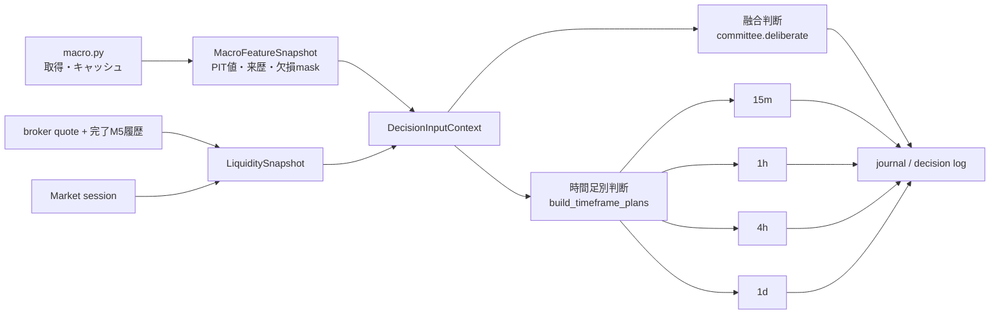

# C. 「入力」の接続と流動性・リスク状態の設計

## 1. 結論

C は、判断時点で利用可能だったマクロ値と broker quote を、一つの版付き
`DecisionInputContext` に固定し、融合判断と時間足別判断の両方へ渡すことで解決する。

1. VIX、米2年・10年金利、ドル指数、COT、マクロ pair score は、表示用の市況文ではなく
   数値特徴と来歴を持つ `MacroFeatureSnapshot` にする。
2. マクロ snapshot は1実行につき一度だけ作り、融合判断と 15m / 1h / 4h / 1d の
   全時間足へ同じ `context_id` で接続する。時間足ごとに再取得してはならない。
3. FXの「流動性」は一つの真値として作らない。現在の broker bid/ask、spread、quote age、
   同一ペア・同一セッション内のspread percentileを主な代理指標とし、セッションと
   ロールオーバー窓を補助文脈として記録する。
4. `macro_quality`、`quote_quality`、`liquidity_status`、既存の `data_quality` は分離する。
   欠損を `neutral` や `normal` に丸めず `unknown` とする。
5. 初期導入では特徴量・監査・shadow評価へだけ接続し、既存の方向や確信度を変えない。
   本番影響は時間足別のOOS評価、承認、rollbackを通った policy だけに許可する。
6. 現行の最短の**判断足は15分**であり、5分は採点価格の収集周期である。Cでこの二つを
   混同しない。将来5分判断を追加する場合は、5分ホライズン用の独立仕様として扱う。

この境界なら、遅いマクロ値を短期判断へ無条件に強く効かせたり、OTC FXに存在しない
「市場全体の出来高」を捏造したりせず、入力不足を監査可能な形で埋められる。

## 2. 現状の断線

### 2.1 マクロと時間足別判断

`fx_briefing.py` はカレンダー、ニュース、マクロ、テクニカルを取得した後、
`--per-timeframe` なら委員会処理の手前で `_run_per_timeframe()` へ分岐する。

- 融合判断は `committee.deliberate()` へ `macro_snapshot` を渡し、COTとレジームから
  `macro_score` を作れる。
- 時間足別判断は `timeframe.build_timeframe_plans()` を直接呼ぶため、VIX、金利、
  ドル指数、COT、`macro_score` を受け取らない。
- 時間足別にも `learning_dimensions.regime` は入るが、これはカテゴリ名であり、
  マクロ数値、変化率、観測日、利用可能時刻、欠損理由を再現できない。

したがって「マクロ取得に成功した」と「各時間足の判断・学習へマクロ特徴が接続された」は
別であり、現状は後者が未達である。

### 2.2 spreadと流動性

`fx_tf_snapshot.py` と `oanda_prices.py` は、完了済みM5のbid/ask OHLCとspreadを
`briefing_tf_prices.jsonl` に保存している。ただし主用途は**判断後の採点経路**である。

- `_run_per_timeframe()` が今回の判断時点に加える `current_snapshot` はclose-onlyである。
- `TimeframePlan.entry_bid / entry_ask` はTradingView側の値があれば入るが、取得元、
  quote age、broker、as-of条件、baselineとの比較を持たない。
- 実測spreadをセッション別の平常値と比較する処理がない。
- spread異常、quote stale、ロールオーバーなどを構造化した流動性ゲートがない。

採点用の将来経路と判断時の入力は責務が異なる。完了M5足の終値を無条件に
「判断時に約定可能だった現在quote」と呼ぶことは禁止する。

### 2.3 5分の意味

現行の `technicals.DEFAULT_INTERVALS` と `timeframe.DEFAULT_TIMEFRAMES` は
`15m / 1h / 4h / 1d` である。M5は `fx_tf_snapshot.py` の収集粒度であり、
5分方向判断ではない。

C1〜C4は、M5入力を利用して**既存の時間足別判断**へ流動性文脈を接続する。
真の5分判断はC5でのみ追加できる。名称だけを5分判断に変えたり、15分用の採点許容幅を
流用したりしてはならない。

## 3. 入力の共通契約

### 3.1 DecisionInputContext

判断ロジックへ個別の辞書を追加し続けず、1実行・1ペアにつき一度だけ共通文脈を作る。

```json
{
  "schema": 1,
  "context_schema_version": "decision-input-v1",
  "context_id": "sha256:...",
  "run_id": "20260717T091500Z:hourly",
  "symbol": "USDJPY",
  "decision_time": "2026-07-17T09:15:00+00:00",
  "macro": {
    "schema_version": "macro-features-v1",
    "snapshot_id": "sha256:...",
    "features": {},
    "quality": 0.86,
    "quality_status": "usable",
    "missing": []
  },
  "liquidity": {
    "schema_version": "fx-liquidity-proxy-v1",
    "snapshot_id": "sha256:...",
    "status": "normal",
    "reason_codes": [],
    "features": {},
    "quote": {}
  },
  "learning_dimensions": {
    "session_bucket": "london_new_york_overlap",
    "regime": "risk_off"
  }
}
```

`context_id` は、symbol、decision time、各snapshot ID、schema versionから決定論的に作る。
同じ実行内の融合判断と全時間足が同じ文脈を参照したことを監査できるようにする。

完全判断ログには文脈全体を自己完結的に保存する。軽量ジャーナルには、学習に必要な
数値特徴、欠損mask、`context_id`、各schema versionを保存する。保存量を減らすために
来歴を省略して、後で現在値から復元することは禁止する。

### 3.2 point-in-time envelope

マクロ値とquoteは、値だけでなく最低限次の包絡情報を持つ。

```json
{
  "value": 24.7,
  "unit": "index",
  "event_time": "2026-07-16T00:00:00+00:00",
  "available_time": "2026-07-17T09:14:02+00:00",
  "ingested_time": "2026-07-17T09:14:03+00:00",
  "first_seen_time": "2026-07-17T09:14:03+00:00",
  "source": "fred",
  "source_record_id": "VIXCLS:2026-07-16",
  "content_hash": "sha256:...",
  "quality_flags": []
}
```

判断に使える条件は `available_time <= decision_time` である。キャッシュを読み直すたびに
`first_seen_time` を現在時刻へ更新してはならない。改定された同じ系列・同じ観測日は
別content hashとして残し、どの版を判断に使ったかを固定する。

過去のマクロ値を現在のAPIから取得してバックフィルする場合、当時利用可能だった版を
証明できなければ `retrospective_only=true` とし、production学習へ入れない。

## 4. マクロ特徴の接続

### 4.1 初期特徴

`MacroFeatureSnapshot.features` は少なくとも次を持つ。値を取得できない項目は0で埋めず、
`null` と対応する `*_available=0` を保存する。

| 特徴 | 単位 | 意味 |
|---|---:|---|
| `vix_level` | index | 最新の利用可能なVIX |
| `vix_change_5d_pct` | % | 5観測前からの変化率 |
| `us10y_level_pct` | % | 米10年金利 |
| `us10y_change_5d_bp` | bp | 5観測前からの変化 |
| `us2y_level_pct` | % | 米2年金利 |
| `us2y_change_5d_bp` | bp | 5観測前からの変化 |
| `curve_2s10s_bp` | bp | 10年−2年スプレッド |
| `usd_index_level` | index | 広義ドル指数 |
| `usd_index_change_5d_pct` | % | 5観測前からの変化率 |
| `cot_base_net_ratio` | ratio | base通貨の投機筋net / open interest |
| `cot_quote_net_ratio` | ratio | quote通貨の投機筋net / open interest |
| `cot_pair_diff` | ratio | base−quoteのCOT差 |
| `macro_pair_score` | -1〜+1 | 現行 `macro_pair_view()` のpair方向スコア |
| `macro_pair_confidence` | 0〜1 | pair scoreの入力coverage |

既存の `risk_on / risk_off / neutral / unknown` は `learning_dimensions` のカテゴリとして
残す。数値特徴とカテゴリレジームは役割が異なるため、どちらか一方へ統合しない。

### 4.2 鮮度と品質

初期のstale上限は現行 `macro.py` と合わせ、日次系列7日、COT 21日とする。
ただし系列単位で判定し、一つがstaleだからsnapshot全体を捨てない。

```text
usable   : 必要な値が1つ以上あり、利用した全値がas-of条件とstale上限を満たす
partial  : 一部が欠損だが、利用可能な値と欠損maskを監査できる
unknown  : 利用可能な値がない
invalid  : future availability、時刻矛盾、hash不整合、単位不明
```

`neutral` は市場判断であり、入力品質ではない。データがない状態を
`regime=neutral` や `macro_pair_score=0` として学習させない。

### 4.3 時間足別への渡し方

`fx_briefing.py` で `MacroFeatureSnapshot` を一度作り、次の両経路へ渡す。



接続は三段階に分ける。

1. **record**: 全数値、欠損mask、来歴、`context_id` を保存する。
2. **shadow**: `macro_pair_score` を時間足別の独立producerとして採点するが、
   `composite`、方向、確信度を変えない。
3. **active**: `(macro, timeframe)` ごとのOOS実績と人間承認を満たした時間足だけ、
   componentとして合成へ参加できる。

融合のmacro stageを時間足別へコピーしてはならない。24時間前後で有効だったmacro意見が
15分後にも有効とは限らないため、promotion stateは最低でも producer × timeframe で分ける。
active化後も重みは正規化し、安全ゲートを解除する方向には使わない。

## 5. FX流動性の代理指標

### 5.1 「流動性」の定義範囲

OTC FXには、システムが観測できる市場全体の一意な板・出来高がない。Cで扱うのは
`broker_liquidity_proxy` であり、主に「このbrokerのこの時点で、売買価格差が平常より
悪化していないか」を表す。

主指標はbroker実測bid/askから作る。

```text
mid             = (bid + ask) / 2
spread_price    = ask - bid
spread_pips     = spread_price / pip_size
spread_bps      = spread_price / mid * 10,000
spread_atr      = spread_price / decision_timeframe_ATR
spread_percentile = 過去の同一symbol・同一session内における順位
quote_age_sec   = decision_time - quote_available_time
```

`pip_size` はJPY quoteなら原則0.01、その他は0.0001とするが、instrument metadataが
利用できる場合はそちらを正とする。OANDA M5の`volume`はbroker固有の活動度の補助診断に
限り、市場全体の取引量とは呼ばない。

### 5.2 3つの価格役割を分離する

| 役割 | データ | 使用目的 |
|---|---|---|
| `decision_quote` | 判断直前に取得したbroker bid/ask | entry候補、quote age、現在spread |
| `liquidity_baseline` | 判断前までの完了済みM5 bid/ask | 平常spread分布とpercentile |
| `outcome_path` | 判断後に完了したM5 bid/ask OHLC | DのTP/SL・純R採点 |

同じOANDA由来でも時間方向が異なる。`outcome_path` を判断入力へ逆流させてはならない。
最新完了M5のcloseはliquidity proxyには使えるが、取得時点の現在quoteでない場合は
`quote_role="completed_bar_proxy"` とし、Dのexecutable entryには使わない。

本命の `decision_quote` は判断run内で同期取得し、bid、ask、broker timestamp、
available/ingested timeを固定する。同期取得に失敗した場合はclose-onlyへ黙ってfallbackせず、
`quote_quality=unknown` と理由を残す。

### 5.3 baselineのas-of計算

spread baselineは必ず `available_time < decision_time` の行だけから作る。
初期候補は直近20市場日、同一symbol × session bucketとする。

- セルの有効標本が100未満ならsymbol全体へfallbackする。
- symbol全体も100未満ならpercentileを作らず `baseline_insufficient` とする。
- 同一 `source_record_id` の時間足複製行は1標本にdeduplicateする。
- closed、invalid quote、未来利用可能行はbaselineから除外する。
- baselineのlookback、最小標本、percentile境界は `ops/input_policy.json` の版付き設定へ置く。

データ蓄積前の暫定値をコードへ散在させず、初期閾値は観測用policyとして固定する。

```text
normal    : valid current quote かつ percentile < p90
thin      : p90 <= percentile < p99
stressed  : percentile >= p99、または構造化した絶対上限超過
unknown   : quote、時刻、baselineのいずれかが不足
invalid   : ask < bid、非正値、時刻逆転、source/hash不整合
```

percentileだけで突然の異常を見落とさないよう、symbol別の絶対spread上限もpolicyに持てる。
ただし値は実データ分布とstress検証から決め、設計書の例を自動的な本番値にしない。

### 5.4 セッションとリスク状態

`LiquiditySnapshot` はBの `session_bucket` を再利用する。セッションをspreadの代用品にはせず、
spreadの比較母集団と説明変数として使う。

```json
{
  "status": "thin",
  "reason_codes": ["spread_p95_same_session"],
  "features": {
    "spread_price": 0.012,
    "spread_pips": 1.2,
    "spread_bps": 0.76,
    "spread_percentile": 0.95,
    "quote_age_sec": 4.1,
    "baseline_n": 482,
    "is_rollover_window": 0
  },
  "quote": {
    "bid": 157.121,
    "ask": 157.133,
    "source": "oanda_v20_pricing",
    "role": "decision_quote"
  }
}
```

`regime`、`liquidity_status`、`event_window`、`market_open` は一つの文字列へ潰さない。
必要なら表示用に次の `tradeability` を派生するが、元状態を必ず残す。

```text
blocked : market closed / high-impact event / invalid quote / approved stressed gate
caution : thin liquidity / partial macro / staleに近いquote
normal  : 明示的な品質条件を満たす
unknown : 判定材料不足
```

## 6. 判断への反映境界

### 6.1 初期導入では判断を変えない

C1〜C3の導入だけでは、既存の `composite`、方向、SL/TP、`risk_pct` を変えない。
次だけを追加する。

- `features` への版付きmacro / liquidity数値と欠損mask
- `input_context` と `context_id`
- `macro_shadow_prediction`
- `liquidity_shadow_gate` の would-block / would-dampen 結果
- 完全判断ログとdashboardのcoverage、鮮度、状態表示

これにより導入前後の判断差が0であることを回帰テストにできる。

### 6.2 承認後の安全側の動作

流動性policyが `active` になった後も、許可するのは安全側の動作だけとする。

| 状態 | 許可する動作 |
|---|---|
| `normal` | 変更なし。確信度を増幅しない |
| `thin` | 承認済み係数による確信度capまたは減衰 |
| `stressed` | 新規方向をneutral/standbyへ変更し、raw方向をshadowに残す |
| `unknown` | 分析方向と「流動性未確認」を表示。自動的にnormal扱いしない |
| `invalid` | actionableなSL/TP提示を止め、構造化reason codeを残す |

流動性ゲートは既存ポジションの決済、結果採点、過去ラベルを書き換えない。
通知専用の現行システムでポジション量を学習・増幅する機能は追加しない。

macro componentがactiveになっても、休場、イベント、品質、期待値、流動性の拒否権より
前段で合成する。macroが強いという理由で安全ゲートを解除してはならない。

### 6.3 gate trace

表示文を後から解析せず、判断時に構造化traceを作る。

```json
{
  "gate": "liquidity",
  "policy_version": "fx-liquidity-policy-v1",
  "stage": "shadow",
  "input_status": "stressed",
  "would_block": true,
  "applied": false,
  "reason_codes": ["spread_p99_same_session"],
  "before_direction": "long",
  "after_direction": "long"
}
```

Bのshadow predictionと同じ `gate_trace` に接続すれば、「異常spreadで見送って損失を
避けたか」と「利益を逃したか」を同じcanonical Net Rで評価できる。

## 7. 学習・評価への接続

### 7.1 特徴量

数値特徴は明示的な単位へ揃え、カテゴリと来歴を数値へ無理に押し込まない。

```text
macro__vix_level
macro__vix_change_5d_pct
macro__us10y_change_5d_bp
macro__curve_2s10s_bp
macro__usd_index_change_5d_pct
macro__cot_pair_diff
macro__pair_score
liquidity__spread_pips
liquidity__spread_bps
liquidity__spread_percentile
liquidity__quote_age_sec
liquidity__spread_atr
liquidity__is_rollover_window
```

各値には `__available` maskを対応させる。`unknown=0` と実測0を同じ値にしない。
カテゴリのsession、regime、liquidity statusはBと同様one-hotにする。

ML feature schemaを上げ、旧artifactを新しい入力幅へ暗黙変換しない。再学習前は
`usable=false` とし、旧モデルは旧schemaの入力だけで動かす。

### 7.2 遅い入力の水増し防止

同じVIX・COT値を、毎時 × 4時間足の独立したマクロ観測として数えてはならない。

- macro producerの実効標本は `snapshot_id` または元観測の `source_record_id` でcluster化する。
- COTは同じreport dateを1つの情報更新として扱う。
- spread baselineは時間足への複製前のM5 record IDでdeduplicateする。
- 時間足別predictionの成績は分けるが、同じrun内の相関を信頼区間で考慮する。
- train / tune / testは時系列順とし、macro公表・判断ホライズンをまたぐembargoを置く。

件数表示にはraw decisionsとeffective observationsの両方を出す。

### 7.3 自動反映への昇格

macro weightとliquidity policyは別々に昇格させる。

```text
recording -> shadow -> ready_for_review -> approved -> active
                     \-> rejected
active -> auto_paused -> approved
```

最低条件はDと同じcanonical `realized_net_r`、未使用期間、コストstress、DSR、
path quality、label coverage、人間承認である。加えて次を要求する。

- macro: producer × timeframeごとにchampionを上回り、単一macro観測日に集中しない。
- liquidity: would-blockがNet RとDDを改善し、単一session・単一symbolだけに依存しない。
- どちらもschema、source、cost model、policy versionが混在していない。
- active後のcoverage低下、quote stale、schema不一致ではauto-pauseし、影響0へ戻す。

短時間足でmacro優位性が確認できなければ、数値は監査・説明用に残し、方向成分にはしない。

## 8. 保存と表示

### 8.1 保存先

`TradePlan` / `TimeframePlan` に無秩序にフィールドを増やさず、次を追加する。

```text
input_context_id: str
input_features: dict[str, float | null]
input_feature_masks: dict[str, int]
input_context: DecisionInputContext       # 完全判断ログ用
gate_trace: list[GateTrace]
```

軽量ジャーナルはcontext ID、学習値、mask、versionを持つ。完全判断ログは元quote、
各macro value envelope、baseline summary、reason codeを持つ。`decision_id` と
`context_id` の対応はappend後に変更しない。

既存ログには次を適用する。

- timestampからsessionを派生できても、当時のspreadやmacro revisionを現在値で埋めない。
- 旧行は `input_context_status="legacy_unknown"` とする。
- 新旧を混ぜた学習ではcoverageを表示し、新特徴を必要とするモデルから旧行を除外する。

### 8.2 dashboard

最初に収益ランキングを出さず、入力が正しく接続されたかを表示する。

1. mode × timeframe別のmacro feature coverage
2. quote source、quote age、bid/ask coverage、invalid件数
3. symbol × session別spread分布、p50 / p90 / p99
4. liquidity status件数とshadow would-block率
5. macro producer × timeframeのshadow Net Rと実効標本
6. liquidity gateの `blocked_but_profitable`、`blocked_and_loss_avoided`、gate value
7. schema / policy / source / cost modelの混在警告

`unknown` をnormalの母数へ含めず、coverage低下で見かけの成績が改善していないかを併記する。

## 9. 実装境界

### Phase C1: 共通入力契約とマクロPIT化

- `fx_intel/input_context.py` に `PointInTimeValue`、`MacroFeatureSnapshot`、
  `DecisionInputContext`、決定論的IDを追加
- `macro.py` のcacheへ `first_seen_time`、source record ID、content hashを保存
- macro数値特徴と欠損maskを1実行につき一度生成
- `fx_briefing.py` から融合・時間足別の両経路へ同じcontextを注入
- journal / decision logへcontext ID、特徴、versionを保存

### Phase C2: 判断時quoteと流動性baseline

- `fx_intel/liquidity.py` を追加し、spread正規化、as-of baseline、status判定を一元化
- `oanda_prices.py` に判断時quote取得を追加し、採点用completed candle取得とAPIを分離
- current quote、baseline、future outcomeの役割をschemaで固定
- session別spread分布を元M5 record IDでdeduplicateして作る
- `ops/input_policy.json` にlookback、最小標本、鮮度、percentile、絶対上限を版付き保存

### Phase C3: record / shadow接続

- `timeframe.build_timeframe_plans()` が共通contextを受け取り、全時間足へ同じmacro特徴を保存
- macro producer stageを `(role, timeframe)` 単位へ拡張
- liquidity shadow gateと構造化 `gate_trace` を追加
- ML dataset builderへ特徴とmaskを追加し、artifact schemaを更新
- dashboardに入力coverage、spread分布、shadow結果を追加
- このphaseではproduction判断差が0であることを固定

### Phase C4: 承認制の本番反映

- macro weight候補とliquidity policy候補を別々にwalk-forward評価
- ready-for-review、明示承認、active、auto-pause、fallbackを実装
- thinは減衰のみ、stressedは新規方向の見送りのみを許可
- 既存の休場、イベント、品質、期待値ゲートの拒否権を回帰テストで固定

### Phase C5: 真の5分判断（別承認）

5分判断が必要なら、C1〜C4完了後に次を別PRで行う。

- `5m` をtechnicals、timeframe、journal、dashboardの正式なtimeframeへ追加
- primary horizonを5分とし、許容幅を事前登録する
- 5分ごとの判断に対して十分な未来点が得られるよう、価格収集をM1またはstreamへ高密度化
- 同一M5足内のentryとoutcomeを使わず、判断後に利用可能になった経路だけで採点
- 15m以上とは別のOOS、コスト、spread、遅延stressと昇格stateを持つ

現行の5分collectorをそのまま使って5分判断を採点すると、主ホライズン内の経路点が不足し、
形成中足や同一足の情報混入を招くため不可とする。

## 10. 必須テスト

1. 同一runの融合判断と全時間足が同じmacro snapshot IDを保存する。
2. macroの `available_time > decision_time` の値は特徴量へ入らない。
3. cache再読込で `first_seen_time` とcontent hashが書き換わらない。
4. staleな一系列だけが欠損になり、snapshot全体の正常値は保持される。
5. macro欠損はmask=0 / value=nullであり、neutralや実測0へ変換されない。
6. `--per-timeframe` の全時間足にmacro数値、来歴、context IDが保存される。
7. C3までの導入前後で既存の方向、確信度、SL/TPが一致する。
8. decision quote、baseline、outcome pathの時間方向とroleが混ざらない。
9. ask < bid、非正値、時刻逆転、stale quoteはinvalid/unknownになりnormalにならない。
10. spread p50 / p90 / p99は判断後の行を使わずas-ofで再現できる。
11. M5を4時間足へ複製した行がbaselineで4標本に水増しされない。
12. session baseline不足時は規定どおりsymbol fallbackし、それも不足ならunknownになる。
13. JPY/non-JPYのpip換算とinstrument metadata優先が正しい。
14. bid/ask spreadをDの純Rで二重控除しない。
15. shadow liquidity gateはwould-blockを記録してもfinal directionを変えない。
16. active policyでもnormal時に確信度を増幅しない。
17. stressed gate後もraw macro/technical仮説がshadowとして採点できる。
18. macro active成績はtimeframe別であり、融合stageを短時間足へコピーしない。
19. 同じmacro source observationのraw件数と実効件数が分けて表示される。
20. legacy行へ現在のmacro/spreadをバックフィルせず `legacy_unknown` とする。
21. schemaまたはpolicy version混在時にML・promotionがfail closedする。
22. input context不良が、休場、イベント、期待値など既存ゲートを解除しない。
23. C1〜C4だけでは`5m`が判断足として誤登録されない。

## 11. 完了条件

- 新規の融合・時間足別判断の99%以上が版付き `context_id` を持つ。
- macro取得成功runの99%以上で、全時間足に同一の数値特徴とsnapshot IDが保存される。
- decision quote coverage、quote age、spread分布、unknown理由をsymbol・session別に説明できる。
- 判断入力、baseline、将来採点経路がroleと時刻のテストで分離されている。
- macro / liquidityのraw件数と自己相関調整後の実効件数を別々に監査できる。
- C3まではproduction判断差が0であり、C4のactive化はOOS評価と人間承認なしに起きない。
- unknown入力がneutral/normalへ丸められず、schema不一致時は影響0へ安全に戻る。
- 5分collectorと5分判断の意味が運用資料、コード定数、dashboard上で混同されない。
