# Institutional research architecture

## Control flow

```mermaid
flowchart LR
    A["Immutable raw observations\nevent/published/available/ingested/revision"] --> B["PIT as-of layer\nUTC, hashes, lineage"]
    B --> C{"Data-quality veto"}
    C -- fail --> N["No trade + alert"]
    C -- pass --> D["Feature snapshots\nfit inside split"]
    D --> E["Direction model / baselines"]
    E --> F["Dedicated probability calibration"]
    F --> G["Meta-label + abstention"]
    G --> H{"Risk veto"}
    H -- fail --> N
    H -- pass --> I["Portfolio sizing\ngross/net/currency/correlation"]
    I --> J["Paper execution\nspread/slippage/latency/rejects"]
    J --> K["Append-only predictions, orders, fills, outcomes"]
    K --> L["TCA, performance and drift"]
    L --> M["Champion/challenger registry\nhuman promotion/demotion"]
```

The research path never enables live trading — the system performs analysis only and never sends real orders (the `trader/` execution stack was removed on 2026-07-10; see [SYSTEM_OVERVIEW](../SYSTEM_OVERVIEW.md)). Governance stage checks and the fail-closed data-quality / risk vetoes remain independent barriers, and "execution" throughout this document means the backtester's simulated fills (`fx_backtester/execution.py`), not a broker connection.

This diagram is the **target control plane**, not a claim that every box is connected end to end. The table below separates implemented primitives from their current integration status. Until the missing connections are completed and independently evidenced, the repository remains research-only.

## Module ownership

| Concern | Implemented primitive | Current connection status |
|---|---|---|
| PIT envelope/as-of/data QA | `fx_backtester/point_in_time.py`, `validation.py`, `qa.py`, `artifacts.py`: aware UTC, normalized legal availability, positive finite OHLC, future-clock rejection, content hash and strict quality checks | **Partial.** Backtest artifact promotion independently rechecks dataset/event provenance, revision contracts and event-vintage clocks against the artifact creation boundary, but the primary briefing/backtest loaders do not yet materialize all macro, COT, news and price inputs through this envelope. |
| Snapshot/journal single writer | `fx_intel/append_only.py`, `price_history.py`, `decision_log.py`, `journal.py`, `tools/run_exclusive.py`: sidecar/file locks, cadence natural keys, canonical hashes, exact-retry idempotence and conflicting-writer rejection | **Connected for price, fusion, timeframe and complete-decision JSONL.** Strict price reads and subsequent writes reject an already duplicated or timestamp-regressing archive. Existing duplicate/unhashed legacy streams therefore remain quarantined until manifest-backed migration; JSONL is still not a promotion-scale transactional store. |
| Freshness/gaps | `tools/data_freshness_monitor.py`, `tools/journal_gap_audit.py`, `fx_intel/freshness.py` | **Connected to canonical briefing when `--require-freshness` is used.** Missing, malformed, future, stale, warning or critical evidence vetoes decisions. Historical contamination still needs migration. |
| Labels | `fx_backtester/labeling.py`: next-open, volatility barriers, stop-first ambiguity, gap stop, first-touch MFE/MAE, net R and label end | **Library only.** It is not yet the sole label path for the legacy outcome learner or briefing ML. |
| Temporal validation | `fx_backtester/time_series_validation.py`, `walk_forward.py`: label-aware purge, embargo, anchored/rolling and CPCV | **Library only.** No promotion-grade orchestrator binds splits, all trials and artifacts; the lockbox-open marker is process-local rather than durable governance state. |
| Overfitting/uncertainty | `overfitting.py`, `statistical_validation.py`, `trial_log.py` | **Primitive available.** PBO requires a complete aligned trial-return family; skipped/invalid evidence fails promotion, but the legacy reporting path is not authoritative. |
| Calibration/no-trade | `calibration.py`, `fx_intel/ml.py`, `decision_pipeline.py` | **Partial.** Five temporal windows and calibration/null/AUC checks exist; production-grade uncertainty, label lineage and end-to-end evidence binding remain incomplete. |
| Cost stress | `stress.py`, `execution.py`, `engine.py` | **Library available.** Promotion evidence must use full reruns; older post-hoc commercial sensitivity is descriptive and inadmissible for this gate. |
| Portfolio risk | `risk.py`, `engine.py`, `governance.py` | **Connected in the backtester.** Entry and marked-to-market gross leverage, currency exposure, loss/DD locks and non-overridable vetoes are simulated; no broker connection exists. |
| Registry/drift | `governance.py`, `drift.py` | **Library/partial integration.** Missing evidence fails and mature-label/schema checks abstain, but no durable authoritative registry service is connected end to end. |
| Reproducibility | `artifacts.py` | **Partial.** Deterministic runs record commit/dirty state, hashes, seed, costs and environment; ML split/lockbox/trial lineage needs a dedicated manifest. |
| Notification operations | `fx_briefing.py`, `scripts/`, `ops/launchd/` | **Prepared, not deployed by this audit.** Canonical launchd topology and freshness vetoes are encoded; the observed Mac mini state requires controlled migration. |

## Storage model

Raw source records are logically immutable. A record’s descriptive time is distinct from first legal availability and actual ingestion. Corrections are new records linked by source ID/revision, not history rewrites. Derived features and labels reference content hashes and versions.

JSONL remains the current vertical slice for low-volume append-only journals. Price, fusion, timeframe and complete-decision JSONL paths now share stable sidecar ownership, file locks, canonical hashes, idempotent identities and fail-closed readers. Legacy unhashed files are inadmissible and must be archived with a hash/row-count manifest before a fresh v2 stream starts. This closes the observed concurrent-writer and silent-corruption path, but it is not a scalable transactional event store: promotion-grade scale should move authoritative journals to SQLite WAL or an append/event database with unique constraints and transactions; JSONL should then become an export artifact.

Prediction, label/outcome, order/fill and evaluation are separate event types linked by IDs. A later outcome must not mutate the original prediction.

## Best-of-N design decisions

| Problem | Option A | Option B | Selected and trade-off |
|---|---|---|---|
| Concurrent journals | Keep plain append and deduplicate later | OS/sidecar locks + natural key now; migrate to transactional DB | **B.** The low-volume v2 slice is delivered for price and decision journals. Controlled legacy archival and remote deployment remain mandatory; a transactional DB is still the scale target. |
| Purging | Fixed row-count gap | Purge by each sample’s `label_end_time` plus embargo | **B**. Multi-horizon labels make row-count purges unsafe. Requires correct label-end metadata. |
| Calibration | Fit Platt on the same validation/test used for early stopping | Separate train/tune/calibration/test/lockbox; compare Platt/isotonic/beta only on a later selection set | **B**. Removes the observed triple-use leakage. Costs samples and delays readiness. |
| Cost stress | Subtract estimated cost from existing trades | Re-run sizing, entries, stops and exits under scaled costs | **B** for promotion evidence. Post-hoc attribution remains descriptive only. Full reruns are slower and require source bars. |
| Same-bar TP/SL | Assume favorable order | Stop-first or unresolved; use trusted lower bars when available | **B**. Avoids optimistic bias; may understate realizable performance. |
| COT availability | `report_date + 3 days` | Official release/first-ingested availability | **B**. Handles holiday/delay changes; requires release metadata capture. |
| Current dirty branch vs rebasing | Destructively reset/rebase | Preserve dirty state and add isolated files/patches | **B**. Protects user work; branch divergence and PR migration remain operational debt. |

## Failure behavior

- Data, timestamp, quote, writer or source failure → abstain; retain raw evidence; notify.
- Missing costs or uncalibrated probability → no new trade; do not assume zero/neutral.
- Drift without mature labels → unsupervised warning/abstention plus human review, not “performance healthy.”
- Performance/calibration breakdown or incident → demote/fallback/stop; automatic retraining cannot promote itself.
- Broker/reconciliation uncertainty → stop new orders and escalate; analysis may continue separately.
