# Institutional research architecture

## Control flow

```mermaid
flowchart LR
    A["Immutable raw observations\nevent/published/available/ingested/revision"] --> B["PIT as-of layer\nUTC, hashes, lineage"]
    B --> C{"Data-quality veto"}
    C -- fail --> N["No trade + alert"]
    C -- pass --> D["Feature snapshots\nfit inside split"]
    D --> E["Direction model / baselines"]
    E --> F["Dedicated probability calibration"]
    F --> G["Meta-label + abstention"]
    G --> H{"Risk veto"}
    H -- fail --> N
    H -- pass --> I["Portfolio sizing\ngross/net/currency/correlation"]
    I --> J["Paper execution\nspread/slippage/latency/rejects"]
    J --> K["Append-only predictions, orders, fills, outcomes"]
    K --> L["TCA, performance and drift"]
    L --> M["Champion/challenger registry\nhuman promotion/demotion"]
```

The research path never directly enables live. `TRADING_MODE=paper`, `ALLOW_LIVE=0`, governance stage checks and the isolated `trader/` stack are independent barriers.

## Module ownership

| Concern | Current implementation | Contract |
|---|---|---|
| PIT envelope/as-of/data QA | `fx_backtester/point_in_time.py` | Aware UTC; availability precedes prediction; immutable hash; fail-closed quality report |
| Snapshot single writer | `fx_intel/price_history.py`, `tools/run_exclusive.py` | OS advisory lock, 5-minute natural key, idempotent replay, conflicting writer rejection |
| Freshness/gaps | `tools/data_freshness_monitor.py`, `tools/journal_gap_audit.py`, `ops/freshness_targets.json` | Source-specific age and journal evidence; nonzero failure exit |
| Labels | `fx_backtester/labeling.py` | Next-open default; volatility barriers; stop-first ambiguity; gap stop; first-touch MFE/MAE; net R; label end |
| Temporal validation | `fx_backtester/time_series_validation.py`, `walk_forward.py` | Label-aware purge, embargo, anchored/rolling, CPCV, non-overlapping tests, one-time lockbox |
| Overfitting/uncertainty | `overfitting.py`, `statistical_validation.py`, `trial_log.py` | Complete trial family; aligned matrices; PBO, DSR/PSR, MTRL, block CI/permutation, Holm, stability |
| Calibration/no-trade | `calibration.py`, `fx_intel/ml.py`, `decision_pipeline.py` | Train/tune/calibration/test/lockbox separation; Platt/isotonic/beta; uncalibrated or uncertain edge cannot pass |
| Cost stress | `stress.py`, `execution.py`, `engine.py` | Full engine rerun at observed/1.5×/2×/3×; costs influence size, fills and exits |
| Portfolio risk | `risk.py`, `engine.py`, `governance.py` | Total gross-notional leverage, currency exposure, loss/DD locks, non-overridable veto |
| Registry/drift | `governance.py`, `drift.py` | Missing evidence fails; adjacent human transitions; PIT/CI/PBO/DSR/calibration/cost gates; no automatic live |
| Reproducibility | `artifacts.py` | Commit/dirty state, input/output hashes, seed, windows, costs, environment and source ledger |
| Paper operations | `trader/`, `scripts/`, `ops/launchd/` | Separate toolchain; one scheduled writer; freshness status; explicit host migration/rollback |

## Storage model

Raw source records are logically immutable. A record’s descriptive time is distinct from first legal availability and actual ingestion. Corrections are new records linked by source ID/revision, not history rewrites. Derived features and labels reference content hashes and versions.

JSONL remains the current vertical slice for low-volume append-only journals. It is protected by `flock`, natural keys and conflict detection. Promotion-grade scale should move to SQLite WAL or an append/event database with unique constraints and transactions; the JSONL files should then become export artifacts, not concurrent primary storage.

Prediction, label/outcome, order/fill and evaluation are separate event types linked by IDs. A later outcome must not mutate the original prediction.

## Best-of-N design decisions

| Problem | Option A | Option B | Selected and trade-off |
|---|---|---|---|
| Concurrent journals | Keep plain append and deduplicate later | OS lock + natural key now; migrate to transactional DB | **B**. It prevents new corruption immediately and preserves existing format. Reads are O(n) and legacy contamination still needs a controlled migration. |
| Purging | Fixed row-count gap | Purge by each sample’s `label_end_time` plus embargo | **B**. Multi-horizon labels make row-count purges unsafe. Requires correct label-end metadata. |
| Calibration | Fit Platt on the same validation/test used for early stopping | Separate train/tune/calibration/test/lockbox; compare Platt/isotonic/beta only on a later selection set | **B**. Removes the observed triple-use leakage. Costs samples and delays readiness. |
| Cost stress | Subtract estimated cost from existing trades | Re-run sizing, entries, stops and exits under scaled costs | **B** for promotion evidence. Post-hoc attribution remains descriptive only. Full reruns are slower and require source bars. |
| Same-bar TP/SL | Assume favorable order | Stop-first or unresolved; use trusted lower bars when available | **B**. Avoids optimistic bias; may understate realizable performance. |
| COT availability | `report_date + 3 days` | Official release/first-ingested availability | **B**. Handles holiday/delay changes; requires release metadata capture. |
| Current dirty branch vs rebasing | Destructively reset/rebase | Preserve dirty state and add isolated files/patches | **B**. Protects user work; branch divergence and PR migration remain operational debt. |

## Failure behavior

- Data, timestamp, quote, writer or source failure → abstain; retain raw evidence; notify.
- Missing costs or uncalibrated probability → no new trade; do not assume zero/neutral.
- Drift without mature labels → unsupervised warning/abstention plus human review, not “performance healthy.”
- Performance/calibration breakdown or incident → demote/fallback/stop; automatic retraining cannot promote itself.
- Broker/reconciliation uncertainty → stop new orders and escalate; analysis may continue separately.
