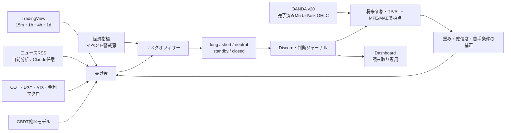

# FX Codex：システム、判断ロジック、データ品質、検証方法

最終更新: 2026-07-17  
対象: `fx_intel/`、`fx_briefing.py`、AI Learning Dashboard、`fx_backtester/`、`trader/`

## 1. 結論

このプロジェクトは、単に「上がる／下がる」を出す予測器ではない。次の3つを分離したFX研究・判断支援・執行基盤である。

1. **分析・判断**: テクニカル、ニュース、経済指標、マクロ、GBDTを統合し、条件が悪ければ見送る。
2. **自己採点・学習**: 過去判断を固定ホライズンやTP/SL先着で採点し、重み・確信度・苦手条件を調整する。
3. **バックテスト・執行**: コスト、リスク、次足約定、OOS、walk-forward、paper/live安全ゲートを別系統で検証する。

設計面では、未来情報の混入防止、データ不足時の見送り、モデルの不参加ゲート、段階昇格、人間承認、実発注の二重ガードが入っており、方向性は良い。

ただし、**現時点の最大の弱点はデータ量と、旧close-only期間を含む実績の薄さである**。新規収集はOANDAの完了済みM5 bid/ask OHLCへ変更したが、過去ログの品質が遡って改善するわけではない。スクリーンショット時点の融合判断は3件中1件的中（33%）にすぎず、GBDT用の新形式採点データも2/150件である。これは「自己学習の器が動き始めた」状態であり、予測優位性や収益性を証明した状態ではない。

## 2. システムの全体像



### 2.1 分析・判断系

中心は [`fx_briefing.py`](../fx_briefing.py) と [`fx_intel/`](../fx_intel/) である。

- [`technicals.py`](../fx_intel/technicals.py): TradingViewのOANDAスキャナーから15m、1h、4h、1dを取得する。
- [`news.py`](../fx_intel/news.py): FXStreet、Google News RSSなどの見出しを集め、通貨タグを付ける。
- [`analyst.py`](../fx_intel/analyst.py) / [`sentiment.py`](../fx_intel/sentiment.py): 通貨別センチメントを作る。既定は自前分析／語彙分析で、Claudeは任意である。
- [`calendar.py`](../fx_intel/calendar.py): 経済指標を取得し、イベント前後の新規判断を抑止する。
- [`macro.py`](../fx_intel/macro.py): COT、DXY、VIX、金利などからマクロ意見を作る。
- [`ml.py`](../fx_intel/ml.py) / [`gbm.py`](../fx_intel/gbm.py): 過去判断からGBDT確率モデルを学習する。
- [`committee.py`](../fx_intel/committee.py): 各委員を統合する。
- [`briefing.py`](../fx_intel/briefing.py): 最後に休場、イベント、品質、期待値を判定する。委員会の総意よりこちらの拒否権が強い。

### 2.2 学習・監査系

- [`journal.py`](../fx_intel/journal.py): 軽量な方向判断ログを保存する。
- [`decision_log.py`](../fx_intel/decision_log.py): 判断、入力、学習状態、根拠を含む詳細な監査ログを保存する。
- [`learning.py`](../fx_intel/learning.py): 方向的中率から重み、確信度、ペア別・状態別補正を作る。
- [`tf_learning.py`](../fx_intel/tf_learning.py): `symbol × timeframe` 単位で同じ学習を行う。
- [`trade_outcome.py`](../fx_intel/trade_outcome.py): MFE、MAE、TP/SL先着、実現R、経路品質を採点する。
- [`oanda_prices.py`](../fx_intel/oanda_prices.py): 完了済みM5足をbid/ask別に取得し、時刻・ソース・hash付きの採点系列へ変換する。
- [`decision_feedback.py`](../fx_intel/decision_feedback.py): 失敗理由を分類し、十分な標本があるセルだけ次回判断を減衰・見送りにする。
- [`promotion.py`](../fx_intel/promotion.py): マクロ委員とML委員を `shadow → paper → live` で管理する。
- [`tools/ai_learning_dashboard`](../tools/ai_learning_dashboard/): ログを表示する読み取り専用UIであり、ダッシュボード自身は売買も学習も実行しない。

### 2.3 バックテスト・執行系

- [`fx_backtester/`](../fx_backtester/): イベント駆動バックテスト、リスク、コスト、walk-forward、PBO/DSR、Monte Carloを扱う。
- [`trader/`](../trader/): TradingView/webhookからRedis Streams、risk、executor、IBKRへ流す実運用スタックである。
- 分析ログと実発注は直接つながっていない。`logs/` はpaper相当の分析・監査用で、`trader/` の発注系はこれを読まない。

## 3. 判断ロジック

### 3.1 テクニカル

各時間足のTradingViewレーティングを次の重みで平均する。

| 時間足 | 重み |
|---|---:|
| 15分足 | 0.15 |
| 1時間足 | 0.30 |
| 4時間足 | 0.30 |
| 日足 | 0.25 |

レーティングは `STRONG_BUY=+1.0`、`BUY=+0.5`、`NEUTRAL=0`、`SELL=-0.5`、`STRONG_SELL=-1.0` に変換する。さらに1時間足のMA短期／長期の向きへ最大 `±0.15` を加える。

記録する主な特徴量は、RSI、ADX、ATR比率、MA乖離のATR換算、時間足一致度、4h／1dレーティング、関連ニュース数、マクロスコアである。

### 3.2 ニュース

ニュースはベース通貨とクオート通貨を別々に採点し、概念的には次でペア方向へ変換する。

```text
pair_news_score = sentiment(base_currency) - sentiment(quote_currency)
```

語彙分析は、金融政策、インフレ、雇用、景気、為替フロー、リスクの語彙、否定表現、鮮度、媒体重みを使う。少数記事で極端な値にならないよう0方向へのシュリンクがある。Claude APIは補助であり、失敗時はローカル分析へフォールバックする。

### 3.3 委員会と複合スコア

初期状態の基本式は次である。

```text
composite = 0.55 × technical_score + 0.45 × news_score
```

マクロ委員の生重みは0.15、ML委員は0.20だが、`paper` または `live` に昇格した委員だけが複合スコアへ参加する。`shadow` 中は意見を計算・記録するだけで、判断には影響しない。参加委員が増えた場合は全重みを正規化する。

ML委員は `P(hit | long) - P(hit | short)` を意見として使う。確率差の絶対値が0.05未満なら「分からない」とみなし、意見を出さない。

### 3.4 データ品質と確信度

融合判断の品質値は次で計算する。

```text
data_quality = 0.50 × technical_coverage
             + 0.30 × news_coverage
             + 0.20 × calendar_availability

raw_conviction = abs(composite) × 100 × data_quality
```

- ニュースは関連5件でカバレッジ満点。
- 品質が0.40未満、またはテクニカルが全欠損なら方向を出さない。
- テクニカルとニュースが逆方向で、双方の強度が0.35以上なら確信度を0.75倍する。
- カレンダー取得不能時は確信度を40以下に制限する。
- 週末休場中は `closed`、重要指標の前120分～後180分は `standby` とする。
- 複合スコアが `+0.15` 以上でlong、`-0.15` 以下でshort、その間はneutralである。
- 過去成績による補正は、原則として増幅より減衰を優先する。

この `data_quality` は「入力がどれだけ揃ったか」を表す簡易スコアであり、価格の正確性、ニュースのpoint-in-time性、約定可能性まで保証する値ではない。

### 3.5 SL、TP、リスク

方向判断があり、終値とATRが取れた場合の初期案は次である。

```text
stop_distance = ATR × 2.5
TP1 = 1R
TP2 = 2R
推奨リスク = 資金の0.5%
```

過去のTP/SL候補がpaper検証を通り、人間承認された場合だけ別のR倍率を適用できる。ATRが無い場合はSL/TPも期待Rも正しく計算できないため、欠陥データとして警告する。

### 3.6 時間足別モード

融合判断とは別に、各時間足を独立したアナリストとして採点する。

| 判断足 | 主採点ホライズン | 採点許容幅 |
|---|---:|---:|
| 15m | 15分後 | ±6分 |
| 1h | 1時間後 | ±15分 |
| 4h | 4時間後 | ±1時間 |
| 1d | 24時間後 | ±2時間 |

30分、8時間、48時間などの補助ホライズンは観測専用で、学習には使わない。同じ判断を複数の未来時点で最適化する多重検定を避けるためである。

## 4. 自己学習の中身

### 4.1 方向学習

long／short判断を主ホライズン後の終値と比較する。週末は市場オープン時間から除き、値動きが記録時ATRの10%以下ならノイズとしてhit／missの分母から外す。同じ判断を複数回採点しない。

学習には次のガードがある。

| 学習項目 | 発動条件 | 動作 |
|---|---:|---|
| テクニカル／ニュース重み | 両方20件以上 | `n/(n+40)` で縮小しながら再推定。テクニカル35～70%に制限 |
| ペア別確信度 | 8件以上 | 0.6～1.0の範囲で減衰のみ |
| 状態×方向 | 1セル12件以上かつ的中率45%未満 | 0.7～1.0の範囲で減衰 |
| 確信度Brier表示 | 20件以上 | 表示確信度が実際の的中率に合っているか比較 |

状態特徴量は相関しやすいため、複数の苦手条件をすべて掛け合わせず、最も悪い1条件だけを適用する。

### 4.2 GBDT

GBDTは「次に上がるか」ではなく、**その方向へ張った判断が当たる確率**を学ぶ。

主な特徴量は、方向符号付きのテクニカル、ニュース、RSI、MA乖離、マクロ、上位足、ADX、ATR比率、時間足一致度、ニュース数、データ品質である。

採用条件は厳しい。

- 同一ペアの判断を最低4時間間隔へ間引く。
- 間引き後150件以上、hit／miss各30件以上が必要。
- 時系列順で末尾20%を検証セットにする。
- 学習／検証境界の学習側から72時間をエンバーゴする。
- 検証セットは30件以上必要。
- Platt scalingで確率較正する。
- 検証Brierが基準率予測より相対2%以上改善し、log lossも改善した場合だけ `usable=True` とする。
- `usable=False` のモデルは保存されても委員会に参加しない。

したがって、「モデルファイルがある」「学習処理が走った」と「判断に使える」は別である。

### 4.3 委員の昇格

マクロ／ML委員の `shadow → paper` には、自己相関を間引いた後で次がすべて必要である。

- 40件以上
- 的中率52%以上
- ATR正規化期待値 `+0.02` 以上
- 50%を帰無仮説にした片側検定で `p ≤ 0.10`
- 前回評価から有意な改善があり、悪化していない

paperで40件以上かつ的中率47%未満になるとshadowへ自動降格する。`paper → live` は数値だけでは進まず、人間の明示承認が必要である。

### 4.4 方向的中率と収益性は別物

本システムは二種類の採点を持つ。

| 採点 | 答える質問 | 限界 |
|---|---|---|
| 方向的中率 | 主ホライズン後に予想方向へ動いたか | 値幅、コスト、SL先着を十分に表さない |
| TP/SL・MFE/MAE・実現R | そのエントリー、SL、TPに正の期待値があったか | 高密度OHLC／tick経路がないと先着順が曖昧 |

勝率が50%未満でも平均利益が平均損失を上回れば正の期待値になりうる。逆に勝率が高くても、損失が大きければ負の期待値になる。そのため、最終判断では勝率より **コスト控除後期待R、Profit Factor、最大DD、Brier、経路品質** を優先すべきである。

## 5. データの質

### 5.1 現在のデータ源

| データ | 主な取得元 | 良い点 | 主な弱点 |
|---|---|---|---|
| テクニカル／現在価格 | TradingView OANDAスキャナー | 複数時間足を同時に取得できる | 非公式スキャナー、現在スナップショット中心、履歴再現性が弱い |
| ニュース | FXStreet / Google News RSS等 | 複数ソース、鮮度重み | 見出しだけ、配信遅延・改稿・重複・取得時刻の監査が必要 |
| 経済指標 | ForexFactory公開フィード | イベント回避に使える | 改定値、公開時刻、取得不能時の扱いに注意 |
| マクロ | COT、DXY、VIX、金利等 | レジーム確認に使える | 公表ラグと改定をpoint-in-timeで保存する必要がある |
| 学習用将来価格 | OANDA v20 完了済みM5 bid/ask OHLC | longをbid、shortをaskで採点でき、形成中足を排除できる | 5分足内でTPとSLの両方へ触れた場合の先着順、スリッページは証明できない |
| バックテスト価格 | CSV、Dukascopy等を想定 | 長期・高密度検証が可能 | OTC FXには統合テープがなく、業者・タイムゾーン・bid/ask差がある |

### 5.2 5分価格スナップショットの役割

毎時判断だけでは15分後や1時間後の価格が採点窓に入らないため、[`fx_tf_snapshot.py`](../fx_tf_snapshot.py) が5分ごとにOANDA v20の最新完了M5足を `price=BA` で取得し、bid/ask別OHLCを保存する。これは短い時間足の採点に必須である。

新規行は `bar_start`、`bar_end`、`available_time`、`ingested_time`、`source_record_id`、`content_hash` を持つ。判断前に開始した足は将来経路から除外し、longの手仕舞いはbid、shortはaskを使う。旧TradingViewの形成中足はcloseだけを方向観測へ残し、high/lowをTP/SL・MFE/MAEへ使わない。

それでもM5 OHLCには次の限界がある。

- 同じ5分足でTPとSLの両方へ触れた場合、どちらが先か分からない。
- bid/askは保存できるが、tick順序、発注遅延、スリッページを完全には再現できない。
- 5分の間に起きた急変を見落とす。

`trade_outcome.py` はこの限界を隠さず、旧close-only経路の品質を最大0.70に制限する。OHLCがあっても同一足内でTPとSLの両方へ触れた場合は `ambiguous_sl_tp` とし、保守的にSL先着、`-1R` と扱う。同一時刻の重複点は1点へまとめ、bid/ask OHLCを優先する。

### 5.3 判断時点で利用可能だったことの証明

MLに使えるデータには、少なくとも次が必要である。

- `event_time`: 市場イベントが起きた時刻
- `available_time`: システムがその情報を利用可能になった時刻
- `ingested_time`: 保存した時刻
- `source`、`source_record_id`、`content_hash`
- `schema_version`、`run_id`、`run_slot`、`writer_id`

特徴量の取得時刻を証明できない旧形式ログをGBDTから除外する判断は正しい。件数を増やすために旧ログを混ぜると、未来情報リークの疑いを消せず、モデル評価全体が無効になる。

### 5.4 重複・欠損・鮮度

過去に複数writerの並走で同一時刻の判断が水増しされた履歴がある。この対策として、排他ロック、`run_slot`、`writer_id`、重複監査が重要である。

運用上の既定監視値は次である。

| 対象 | 期待周期 | warning | critical |
|---|---:|---:|---:|
| 価格スナップショット | 5分 | 15分 | 45分 |
| 融合／時間足別判断 | 1時間 | 2時間 | 6時間 |
| 学習・昇格状態 | 1時間 | 3時間 | 原則warning |

欠損期間を現在値から補間してはいけない。外部OHLCで価格経路だけをバックフィルする場合も、`is_backfill`、元ソース時刻、取得時刻、run ID、品質フラグを付け、当時のニュースやスプレッドを再現したことにしてはいけない。

### 5.5 バックテスト入力の品質ゲート

[`data.py`](../fx_backtester/data.py)、[`qa.py`](../fx_backtester/qa.py)、[`validation.py`](../fx_backtester/validation.py) は次を検査する。

- `timestamp, open, high, low, close` の必須列
- 時刻昇順、重複なし、OHLC欠損なし
- `high ≥ open/close ≥ low` と `high ≥ low`
- 想定頻度に対する欠損率（既定上限0.05%）
- スプレッドとスリッページが正
- 通貨換算レートの有無
- シグナル時刻より約定時刻が後であること
- リスク率、レバレッジ、手数料、ポジション上限の妥当性

一方、単純なCSV検査だけでは、タイムゾーン誤り、夏時間、bid/askの取り違え、将来改定データ、休日の疑似バー、異常スパイク、業者間乖離は十分に検出できない。これらは別のデータ監査が必要である。

## 6. スクリーンショットの正しい読み方

スクリーンショット時点では次の状態である。

- 融合判断は **3件採点、1件的中、33%**。
- 時間足×通貨ペアのセルは数十～百件あるが、融合判断とは別の母集団である。
- GBDTに投入できる新形式の採点済みデータは **2/150件**。
- 特徴量取得時刻を証明できない旧形式225件はGBDT学習から除外。
- 融合判断の採点待ちは22件。

ここから言えるのは「記録、採点、表示のパイプラインが動いている」ことまでである。33%は標本3件の値なので、真の的中率の推定、重み変更、モデル比較、運用判断には使えない。

時間足別の件数が多く見えても、次を確認せずに合算してはいけない。

- 同じ時刻・同じ相場状態の判断は強く相関している。
- 15m、1h、4h、1dは目的変数のホライズンが違う。
- EURUSD、GBPUSD、USDJPYもUSD要因を共有する。
- 方向判断、見送り、イベント待ちは別クラスである。
- 旧形式と新形式はpoint-in-time証明の強さが違う。

## 7. 正しい検証手順

### Step 0: 仮説と合格条件を先に固定する

実験前に、対象ペア、時間足、保有時間、特徴量、SL/TP、コスト、評価指標、OOS期間、停止条件を決める。結果を見てから閾値や期間を変えた場合は新しい試行として記録する。

主指標は一つに固定する。推奨は `コスト控除後 expectancy_R`。補助指標としてProfit Factor、最大DD、Sortino、Brier、取引数、経路品質を見る。勝率単独を主指標にしない。

### Step 1: point-in-timeデータ監査

1. 判断時点より後に利用可能になった特徴量がないか確認する。
2. 重複、時刻逆転、欠損、writer多重起動を監査する。
3. タイムゾーンとDSTをUTC基準で統一する。
4. 価格、ニュース、イベント、マクロごとに `source_timestamp` と `ingested_at` を残す。
5. 旧形式、バックフィル、リアルタイム収集を別フラグで分ける。

ここで不合格のデータは、後段で高いSharpeが出ても採用しない。

### Step 2: ロジックと不変条件のテスト

ネットワークをモックし、次をテストする。

- 欠損時に見送るか
- 休場・イベント窓で新規判断を止めるか
- GBDT不合格時に委員会へ参加しないか
- shadow委員が複合判断へ影響しないか
- 同一足TP/SLが保守的に処理されるか
- シグナルが次足始値より前に約定しないか
- Liveが明示承認なしに有効化されないか

### Step 3: データ品質レポート

ペア・期間ごとに、行数、期間、頻度、欠損、重複、OHLC異常、スプレッド分布、異常値、ソース差、バックフィル率を保存する。品質レポートとデータhashがないバックテストは比較対象にしない。

### Step 4: 単純ベースラインと通常バックテスト

複雑なモデルより先に、buy-and-hold、常時flat、ランダム方向、MAクロス、Donchianなどと比較する。

バックテストは次の前提を固定する。

- 足確定後にシグナル、成行は次足始値
- 買いはAsk、売りはBid相当
- spread、slippage、commissionを必須化
- ギャップ時のSLはストップ価格ではなく不利な始値
- 同一足TP/SLはSL優先
- リスク率、日次損失停止、レバレッジ、通貨エクスポージャーを反映

### Step 5: walk-forwardと過学習検定

時系列順に、学習区間でだけパラメータを選び、直後の未使用テスト区間へ固定適用する。

- `purge` と `embargo` を評価ホライズン以上に設定する。
- パラメータ組合せを小さく保つ。汎用walk-forwardの既定上限は20。
- 全試行を保存し、最良試行だけを残さない。
- 最低3 fold以上を確認する。
- PBOは0.5未満、DSRは0.95以上を目安にする。
- OOSの取引数は最低30件を入口とし、実際の採用にはより多い標本を求める。

GBDTについても単一の80/20分割だけで最終採用せず、時系列rolling OOSでBrier、log loss、expected Rの安定性を再確認するのが望ましい。

### Step 6: コスト・ストレス・Monte Carlo

- spread／slippageを0.5、1.0、1.5、2.0倍で再計算する。
- ロンドン・NY重複、ロールオーバー、週末、重要指標、介入、流動性ショックを分ける。
- 少なくとも1,000、推奨2,000以上のMonte Carlo経路で取引順序と損失尾部を見る。
- 破産基準、最大DD、回復期間、連敗数を確認する。
- 1.5倍コストで赤字になる戦略はlive候補にしない。

### Step 7: paper／forward

コードも閾値も固定し、未使用期間で最低30日、できれば複数レジームにまたがって収集する。

- バックテストとpaperの取引数、期待R、勝率、spread、slippage差を比較する。
- 判断が出なかったケースも記録する。
- stale、API失敗、再起動、重複、欠損を含めた運用品質を測る。
- 価格経路は可能ならDukascopyまたはOANDAのOHLC／bid-askで独立再採点する。

### Step 8: shadow → paper → 最小live

数値条件を満たしても、いきなり通常サイズへ上げない。

1. shadow: 記録のみ
2. paper: 助言・仮想約定へ参加
3. live最小ロット: 人間承認、`ALLOW_LIVE=1`、Kill switch確認後のみ
4. 段階増量: 各段階で再度停止条件を確認

想定外約定、二重発注、監視欠落、broker／DB不一致が一度でも起きたらKill switchを入れて前段へ戻す。

## 8. 既存の商用ゲートと注意点

[`analysis.py`](../fx_backtester/analysis.py) の既定ゲートは次を要求する。

- 構造監査合格
- 365日以上
- OOS 30取引以上
- walk-forward 3 fold以上
- 2ペア以上
- 月次12か月以上
- Monte Carlo 1,000経路以上、破産確率5%以下
- リスク率ベースのロット管理
- forward／paper 30日以上

加えて、設定上は全評価月で月8%目標達成を商用必須条件にしている。これは事業目標としては理解できるが、統計的な汎用合格基準としては強すぎる。毎月8%を満たすよう最適化すると過学習や過大リスクを誘発しうるため、採否の中心は **期待R、DD、コスト耐性、確率較正、forward再現性** に置き、月次目標は別の事業KPIとして扱う方が安全である。

## 9. 現時点の品質評価

| 項目 | 評価 | 理由 |
|---|---|---|
| システム構造 | 良い | 分析、学習、執行、監査が分離され、拒否権と段階昇格がある |
| 判断ロジック | 概ね良い | 欠損・対立・イベント・休場を明示的に見送れる |
| 過学習対策 | 良い設計 | 時系列分割、間引き、エンバーゴ、Brierゲート、PBO/DSRがある |
| 現在の学習データ量 | 不十分 | 融合3件、GBDT新形式2/150件では統計判断できない |
| 価格経路品質 | 改善実装済み・蓄積待ち | 新規収集は完了済みM5 bid/ask OHLC。旧close-only期間と足内順序・スリッページの限界は残る |
| point-in-time品質 | 改善中 | 旧形式を除外する方針は正しい。新形式を継続蓄積する必要がある |
| 収益性の実証 | 未証明 | 方向的中率は実現損益ではなく、十分なOOS／forwardがない |
| 実発注品質 | 未検証部分あり | IBKR接続・実約定を含むend-to-end実証は別途必要 |

総評は、**「安全性を意識した研究・判断基盤としては良いが、データとforward実績が不足しており、勝てるシステムとしてはまだ未証明」**である。

## 10. 優先順位

1. **新形式ログを汚さず継続収集する**: まずGBDTの150件を満たす。件数だけでなく、hit／miss各30件、検証30件、72時間エンバーゴ後の学習件数が必要。
2. **OANDA bid/ask経路を継続収集する**: `.env` のトークン設定後、新形式だけで十分なforward期間を作り、旧close-only採点と分離して比較する。
3. **重複と鮮度を常時監視する**: 排他ロック、run slot、writer、content hashで多重記録を防ぐ。
4. **融合と時間足別を別モデルとして評価する**: 母集団、目的変数、ホライズンを混ぜない。
5. **主指標をexpected Rへ固定する**: 方向的中率は補助表示にする。
6. **rolling OOSを追加する**: GBDTの単一検証区間だけでなく複数foldのBrier／expected Rを確認する。
7. **paper差分を蓄積する**: バックテスト、判断時価格、仮想約定、実際のbroker quoteの差を測る。

## 11. 再現用コマンド

```bash
cd /Users/takahashifuuki/Desktop/fx-codex

# コード品質
python3 -m pytest -q
python3 -m ruff check .
python3 -m black --check .
python3 -m mypy fx_backtester fx_intel *.py

# データ収集・鮮度・重複
python3 tools/data_freshness_monitor.py
python3 tools/journal_gap_audit.py logs/briefing_journal.jsonl
python3 tools/journal_gap_audit.py logs/briefing_tf_journal.jsonl

# 期待値と失敗理由
python3 tools/trade_outcome_monitor.py
python3 tools/decision_expectancy_monitor.py
python3 tools/maximization_monitor.py

# Discord送信なしで1回収集
python3 tools/learning_capture.py --keep-going
```

実行時には、コマンドが成功したかだけでなく、使ったログディレクトリ、データhash、期間、行数、採点可能件数、除外理由、警告を成果物として残すこと。

## 12. 最終判断

このシステムの良さは、予測を無理に出すことではなく、**分からないときに見送り、弱いモデルを不参加にし、ログを残し、段階的に信頼を上げる構造**にある。

次のマイルストーンは的中率を上げることではない。まず、新形式のpoint-in-timeデータ、OHLC／bid-ask価格経路、重複のないforwardログを十分に集め、コスト控除後期待Rがrolling OOSとpaperの両方で再現するかを確認することである。それが確認できるまでは、ダッシュボードの数字は学習進捗であって、収益保証やlive投入根拠ではない。
