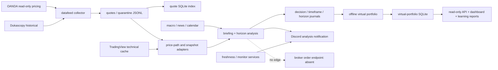

# Phase 0 inventory and freeze — 2026-08-02

Freeze capture: **COMPLETE**. Canonical integration-worktree validation: **PASS**. Mac mini dirty
checkout validation: **FAIL**. Activation/deployment: **BLOCKED**. This record does not approve a
feature flag change, model promotion, paper broker connection, or live execution. The repository
remains analysis-only.

Evidence ID: `20260802T002944Z-phase0-final` (UTC). The full secret-safe inventories and command logs
are mode `0700`/`0600` host artifacts:

- MacBook audit: `/Users/takahashifuuki/fx-codex-audit/20260802T002944Z-phase0-final`
- MacBook rescue: `/Users/takahashifuuki/fx-codex-rescue/20260802T002944Z-phase0-final`
- Mac mini audit: `/Users/fuuki/fx-codex-audit/20260802T002944Z-phase0-final`
- Mac mini rescue: `/Users/fuuki/fx-codex-rescue/20260802T002944Z-phase0-final`

The inventories export environment-variable names, file metadata, hashes, schemas, and row
counts, but never environment values, remote URLs, JSONL values, or SQLite row contents. The
inventory contract is `fx-codex-phase0-inventory-v2`; the reproducible collector is
`tools/phase0_inventory.py`, SHA-256
`92aa62a3b9a29a6ae233454d82852db5f4624f872267cdd63438b7c84d02ca17`.

## Completion decision

| Phase 0 condition | Result | Evidence |
|---|---:|---|
| Pre-change source/config state is reproducible | PASS | HEAD snapshot, binary dirty patch, approved untracked snapshot, environment/dependency inventory, launchd safe-view hashes |
| Live runtime data observation is byte-reproducible | PARTIAL | Stable SQLite/JSONL observations are hash-bound; the changing quote index is explicitly non-atomic and runtime data is excluded from rescue |
| Known FX Codex production order surfaces are disabled | SCOPED PASS | No order capability in repository tests or declared FX Codex services; structural no-order tests: 9 passed |
| Existing tests pass in the canonical integration worktree | PASS | MacBook full baseline: 1,672 passed, 1 skipped; final Phase 0 delta: 6 passed; current full ruff/black/mypy passed |
| Existing production behavior unchanged | PASS | No plist, service, writer, database, journal, flag, policy value, or runtime checkout was changed |
| Mac mini dirty checkout is a valid release candidate | FAIL | Full development suite: 31 failed, 1,462 passed, 1 skipped; tracked black: 1 failure |
| Phase 1 activation/deployment | BLOCKED | Requires a clean release and new host-bound evidence |

The mutable Mac mini checkout is deliberately **not** classified as a clean release candidate.
Its captured development suite has 31 failures (`1462 passed, 1 skipped`), and tracked black
finds `fx_intel/timeframe.py` unformatted. These pre-existing deployment-drift findings do not
erase the Phase 0 freeze; they fail closed and block all later host activation or code deployment
until a separately reviewed clean-release migration. Mypy, ruff, the nine order-surface tests,
service status, freshness, and virtual-portfolio readiness passed on the host.

The final delta changes only the new inventory collector/test/document files; no other test imports
that collector. A reconstructed `/tmp` source copy was also attempted, but three runtime-identity
tests correctly rejected the copy because it lacked the reviewed `.venv`; that run is retained as
invalid-environment evidence and is not counted as a product failure or a pass.

## Frozen Git and runtime identity

| Host | HEAD | Branch | Dirty state at inventory |
|---|---|---|---|
| MacBook | `4a59ba57a9ecd3cb45099fe3d85a8f1afade7441` | `codex/timeframe-counterfactual-contract` | validated prestate snapshot: dirty; user-owned tracked/untracked work preserved. Final v2 Git status: unavailable (timeout) |
| Mac mini primary root | `f473141f63efeb1d96bbda7f84e77deff5df6186` | `deploy/dashboard-wilson-20260729` | 110 tracked changes, 1,830 untracked files, 0 deleted, 1 sensitive path |

The MacBook source-reproduction basis is inherited from the validated prestate capture
`20260801T234522Z-phase0`: its HEAD archive, binary tracked patch, Git status, and approved
untracked overlay are carried into the final rescue artifact. The final v2 runtime inventory's
bounded Git-status probe timed out (`status_error=timeout_or_unavailable`), so its status/diff
fields are unavailable and are not presented as a second successful observation. The final
artifact hashes bind the inherited prestate plus the reviewed Phase 0 overlay.

The final Mac mini inventory hashes are recorded in the artifact manifests. `inventory_sha256`
is the internal canonical-object hash, not the physical SHA-256 of `inventory.json`. Its tracked
dirty patch hash is `da5867f0208c3d57607a11dd04ccf2adb7821da25ba956f586579e6169fd487c`.
The host uses three runtime roots: the primary dirty root, the immutable dashboard/read-API
release `fx-codex-ai-learning-net-r-v3-a11801970c8c`, and the operational read-only checkout
`fx-codex-operational-20260727T050500Z`. This mixed topology is frozen evidence, not an endorsed
target architecture.

## Current data flow

The optional raw-ledger shadow adapter remains default-off. No observation in this Phase 0 run
enabled it or altered accepted/quarantine output.

## Process and launchd inventory

Seventeen `com.fx-codex.*` plist files were hashed. Sixteen labels were loaded when observed;
`operational-replay` was installed but not loaded. There was no user cron and Docker was
unavailable. `operational-sync` had a non-zero last exit status (`2`); this is retained as an
operations finding.

| Runtime root | launchd responsibilities |
|---|---|
| primary `/Users/fuuki/srv/fx-codex` | `briefing`, `datafeed-collector`, `health`, `horizon`, `monitors`, `price-path-adapter`, `quote-index`, `snapshot`, `virtual-portfolio`, `virtual-portfolio-close`, `virtual-portfolio-learning` |
| immutable dashboard release | `dashboard`, `dashboard-state`, `virtual-portfolio-read` |
| operational read checkout | `operational-read`, `operational-replay`, `operational-sync` |

Observed long-running endpoints were the virtual-portfolio read API on `127.0.0.1:8771`, the
dashboard on port `8788`, and the operational read API. Scheduled briefing, horizon, dashboard
snapshot, and monitor workers were also observed. The exact PID, parent PID, start time,
executable basename, value-free process class, schedule, working directory, and launchd safe-view
hash are in `inventory.json`. Raw process, Docker, and launchd argument values and physical plist
hashes are intentionally absent.
No current writer conflict was reported by `status_fx_services.sh` or the captured `lsof` check.

## Stores and schemas

All five SQLite files returned `PRAGMA integrity_check=ok`. The inventory binds the main database
and WAL as one durable component set, records SHM separately, runs schema/count/integrity queries
inside one read transaction, and hashes the durable set again afterward. Row counts are marked
reproducible only when the before/after durable component sets match; a changing live store is
explicitly `non_atomic_live_store`. Schema hashes bind the queried `sqlite_master` definitions.

| Store | Key rows | Schema SHA-256 |
|---|---:|---|
| `collect/index/quotes.sqlite3` | `quote_offsets=1,279,564` | `d3e040f25b997045c971889191d3c5534d3c45dfb4e2c6e985765e16829dbf96` |
| `logs/backups/fx_virtual_portfolio-pre-v2-20260729T150702Z.sqlite3` | historical backup | `06aa5edd6d20b9cca8a9283c5ae54cc1ff8a5a24895ae90f5c7398eb79f3c7e3` |
| `logs/fx_virtual_portfolio.sqlite3` | `decision_records=6,376`, opens/closes `34/34` | `0daf323877d01f77635cdeb1314d5576a1db9288ff15a33a25b75514d71a6dbe` |
| `runs/operational_20260727T122954Z/operational.sqlite3` | `price_points=40,002` | `bbf71d9deaf0ec2f22852c328771a5181d8df2fce8b64ace1c1e61daf8210b13` |
| `runs/operational_20260727T122954Z_v2/operational.sqlite3` | `price_points=40,002` | `bbf71d9deaf0ec2f22852c328771a5181d8df2fce8b64ace1c1e61daf8210b13` |

Four stores had stable before/after durable component sets. The live quote index changed during
observation and is correctly marked `non_atomic_live_store`; its reported row count is a
read-transaction observation, not a byte-reproducible snapshot. Phase 0 did not pause its writer
or copy the live database.

| JSONL | Rows | Malformed / naive timestamp / event-after-availability |
|---|---:|---:|
| `collect/log/quarantine.jsonl` | 21,699 | `0 / 0 / 0` |
| `collect/log/quotes.jsonl` | 1,279,564 | `0 / 0 / 0` |
| `logs/briefing_decisions.jsonl` | 28,971 | `0 / 0 / 0` |
| `logs/briefing_decisions_news.jsonl` | 713 | `0 / 0 / 0` |
| `logs/briefing_horizon_forecasts.jsonl` | 76,572 | `0 / 0 / 0` |
| `logs/briefing_journal.jsonl` | 2,177 | `0 / 0 / 0` |
| `logs/briefing_tf_journal.jsonl` | 36,505 | `0 / 0 / 0` |
| `logs/briefing_tf_prices.jsonl` | 80,838 | `0 / 0 / 0` |
| `logs/canonical_outcomes.jsonl` | 32 | `0 / 0 / 0` |

The dedicated journal audit also preserves negative historical evidence. The fusion journal has
551 duplicate rows (27.4%), 21 time reversals, 167 unparsable timestamps, and 19 gap intervals.
The timeframe journal has 1,916 duplicate rows (5.6%), 14 reversals, 1,989 unparsable timestamps,
and 6,912 gap intervals under a five-minute expectation. Many gaps start during market closure;
none were silently rewritten. These findings block using the historical files as promotion-grade
evidence, but current freshness was `overall=ok` with all three monitored targets healthy.

## Risk-changing configuration inventory

Only names, hashes, JSON validity, and top-level keys were exported; values were not copied into
the audit report.

| File | SHA-256 |
|---|---|
| `config/data_platform_slo_v1.json` | `5964c47124028eb0463760052e703772e4ce9fbe7803351509ddf7e3b3f3df0b` |
| `ops/freshness_targets.json` | `169ea64fc707247a041eaa1667dfd6a5d18dc11f64fba99947909920085c204f` |
| `ops/freshness_targets_timeframe.json` | `b652e16c64b99eb321a884d4de27b50a9a3cbf83f314b3584732c72d2f1fa4e4` |
| `ops/input_policy.json` | `69a5fa4194cc2c419cf3e851af4047a4983ad65ac33c9db9f931c7c03aab7342` |
| `ops/moderate_aggressive_shadow_policy.json` | `dc4e11bb2ef85b94565edfc4513cb82412a74d17771e5ba2544c53a2df8ed667` |

No risk-policy value was changed. Any later edit to these files requires a new before/after hash,
tests, review, and explicit approval.

## Order-path evidence and scope

- `virtual_portfolio_readiness.py --check-launchd`: all P0–P6 engineering stages 100%,
  `broker_connected=false`, `execution_mode=offline_simulation`, `read_only=true`.
- `test_no_live_execution_surface.py` plus `test_collect_no_order_path.py`: 9 passed.
- scoped launchd, process, listener, cron, and Docker evidence contains no active named
  trader/executor or broker mutation route. Unstructured process/Docker command values are never
  exported; only value-free safe-view hashes and safe metadata are retained.
- Three old `.claude/worktrees` contain dormant historical `trader/` trees. They are not loaded,
  executed, referenced by active plists, or copied to the rescue artifact. They were preserved
  because deleting user worktrees is outside Phase 0; their cleanup requires a separately
  approved destructive action.

This is a repository-and-declared-service assertion, not proof that every neutral-named process,
system launchd domain, or network peer on the host lacks broker capability. The inventory's
`runtime_order_surface_verified=false` intentionally preserves that limitation. The completion
gate is therefore scoped to FX Codex's tracked code and declared services; whole-host broker
egress remains outside the evidence and cannot be inferred as absent.

## Rollback and reproduction

Phase 0 changed no runtime behavior, so immediate operational rollback is a no-op. To reproduce
the frozen source state, use a new isolated directory—not the live checkout:

1. Verify `rescue-manifest.json` and every file SHA-256.
2. Extract `tracked-head.tar.gz`; it contains only the recorded HEAD snapshot and no rescue refs.
3. Apply `tracked-working-tree.patch` with `git apply --binary` in an isolated Git worktree based
   on the recorded HEAD.
4. Restore only paths in `safe-untracked-allowlist.txt` from `approved-untracked/`.
5. Do not restore `.env*`, keys, backups, `.claude/worktrees`, SQLite/JSONL runtime state, caches,
   or raw data from this source rescue. Those stores were not changed. Stable SQLite component
   sets and JSONL bytes are observation-bound by the inventory, but excluded runtime data is not
   restorable from this source rescue.
6. Re-run ruff, black, mypy, pytest, structural no-order tests, SQLite integrity, writer
   uniqueness, and freshness checks before any separately authorized clean-release swap.

The Mac mini rescue contains 83 hashed files: the current tracked snapshot, dirty patch, status,
classification,
allowlist, and 76 approved untracked files. One `.env.bak-*` path and runtime/tool-state trees were
excluded; the content scan found zero secret suspects in approved files.

`inventory_sha256`, `manifest_sha256`, and physical artifact SHA-256 values are distinct. The
internal values hash the object before its own hash field using UTF-8 JSON with sorted keys and
compact separators; the audit manifest separately records the physical bytes of every artifact.
Verification must first hash physical files from `audit-manifest.json`/`rescue-manifest.json`,
then independently recompute the internal canonical hash. The primary operator collected and
re-read the Mac mini artifacts over SSH. The independent reviewer verified the local rescue
manifest and permissions but did not independently access the Mac mini, so remote verification is
not claimed as reviewer-independent.

## Residual gates after Phase 0

- Do not deploy from the Mac mini dirty primary root. Build a clean, reviewed release from the
  canonical integration source and repeat the migration runbook.
- Resolve or replace the mixed three-root launchd topology before claiming a canonical runtime.
- Investigate `operational-sync` exit status `2` without restarting services blindly.
- Treat historical journal duplicates, reversals, unparsable timestamps, and cadence gaps as
  data-quality blockers for performance or promotion claims.
- Keep `FX_RAW_LEDGER_ENABLED=false` until Phase 1 host-bound capacity, backup/restore, freshness,
  permission, and writer-uniqueness gates are independently approved.
