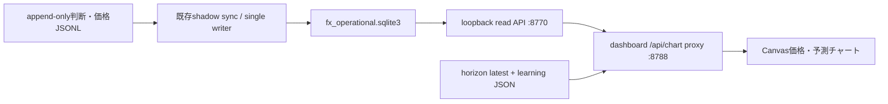

# 設計E: 実測価格と予測位置を重ねるダッシュボード

設計日: 2026-07-29  
対象: `tools/ai_learning_dashboard/` (`http://100.118.242.40:8788/`)  
状態: 設計レビュー待ち。コード変更・Mac mini配備は未実施。

## 1. 目的

「現在の予測と運用判断」の先頭で、実測価格と予測を同じ時間軸・価格軸に表示する。
利用者が一画面で次を判別できることを完成条件にする。

1. どの通貨ペア・時間足を見ているか
2. いつ、どの価格で予測したか
3. 上昇・下落・横ばいのどれを、どのホライズンに対して予測したか
4. 実際の運用判断と、見送り中の分析仮説が同じか異なるか
5. 予想帯、stop、target1、target2がどの価格水準か
6. 見送り・中立になったゲートとデータ品質
7. 満期後に実際の価格がどう動き、的中・外れ・小動きのどれになったか

この画面は分析・shadow判断の可視化であり、注文、ポジション、口座リスクの操作を
一切持たない。

## 2. 現状確認

2026-07-29 JSTに稼働画面と`/api/state`を読み取り確認した。

- 現在の画面は判断件数、的中率、直近の答え合わせ、9ホライズン表を表示するが、
  実価格系列と予測を重ねるチャートはない。
- `briefing_tf_prices.jsonl`は約5分ごとの実測スナップショットを持つ。
  `close`に加えて取得できた場合は`open/high/low/bid/ask`を持つ。
- 既存のOHLCは原則`forming_bar_snapshot`であり、完成ローソク足ではない。
  完成足に見せる表示は禁止する。
- 時間足別判断は`prediction_time`、`close`、`direction`、
  `analysis_direction`、`composite`、`analysis_conviction`、`gate_trace`、
  `horizon_hours`、PIT証跡を持つ。
- `shadow_predictions`にはATRベースの`stop/target1/target2`がある。
- 9ホライズン予測には`p_up/p_down/p_flat`、`close`、
  値幅差分の`band_p10/p50/p90`、`band_source`、`calibrated`がある。
  現在の`/api/state`は確率までしか返さず、帯の値を落としている。
- 稼働APIの価格JSONLは約35 MB、ホライズンJSONLは約106 MB、
  完全判断ログは約1.2 GB。表示のたびに全履歴を再走査する方式を
  チャートへ広げてはならない。
- 現在の`/api/state`取得は観測時に約8秒かかった。チャートは同APIへ
  大量の価格点を追加せず、時間範囲を限定した別APIに分離する。

### 現在データを使った表示例

観測したUSDJPY 4時間足の一例:

- 判断価格: `163.852`
- 分析仮説: 上昇、score `+0.42`
- 運用判断: 中立
- 見送りゲート: `expectancy_guard`
- shadow stop: `163.383`
- shadow target1: `164.321`
- shadow target2: `164.790`

チャートでは、`163.852`に「分析上昇」の中抜きマーカーを置き、
「運用は見送り」を併記する。stop/targetは破線で表示するが、
注文水準または推奨売買とは表現しない。

## 3. 画面設計

「現在の予測と運用判断」ビューの上部、学習状態カードより前に
`実測価格と予測`パネルを置く。

```text
┌ 実測価格と予測 ──────────────────────────────────────────────┐
│ [USDJPY▼] [15分][1時間][4時間][日足]  [6h][24h][3d][7d]      │
│ データ: 2分前 / PIT適格 / 形成中スナップショット / bid-askなし │
├───────────────────────────────────────────────────────────────┤
│ target2 ─ ─ ─ ─ ─ ─ ─ ─ ─ ─                              │
│ target1 ─ ─ ─ ─ ─ ─  予想帯 p10 ─ p50 ─ p90                  │
│                 △ 分析上昇 / 運用見送り ─────── 満期           │
│ 実測価格 ～～～～●～～～～～～～～～～～～～～                  │
│ stop    ─ ─ ─ ─ ─ ─ ─ ─ ─ ─                              │
├───────────────────────────────────────────────────────────────┤
│ 選択中: 07:30 USDJPY 4h / 分析上昇 +0.42 / 運用中立            │
│ 理由: expectancy_guard / 予想帯・確率・PIT証跡・採点状態        │
└───────────────────────────────────────────────────────────────┘
```

### 3.1 操作

- 通貨ペア: `USDJPY / EURUSD / GBPUSD`
- 分析時間足: `15m / 1h / 4h / 1d`
- 表示範囲: `6h / 24h / 3d / 7d`
- レイヤー切替:
  - 実測価格
  - 運用判断
  - 分析仮説
  - 予想帯
  - stop/target
  - 採点結果
- 初期値: 前回選択をlocalStorageから復元。未保存時は`USDJPY / 1h / 24h`。
- 30秒ごとの全画面更新とは分離し、選択変更時と60秒周期でチャートだけ更新する。
- ホバーまたはタップで、その時点の価格、予測、ゲート、確率、PIT状態を表示する。

### 3.2 価格レイヤー

| 入力品質 | 表示 |
|---|---|
| `completed_bid_ask_bar`かつOHLC完全 | ローソク足。bid/ask由来であることを明記 |
| `forming_bar_snapshot` | 5分間隔の実測`close`線。ローソク足にしない |
| `quote_snapshot` | 実測midまたはcloseの点・線 |
| bid/ask両方あり | 薄いbid-ask帯を重ねる |
| 欠損・stale・未来時刻 | その区間を切り、品質警告を表示 |

初版は外部CDNを使わず、既存構成に合わせたCanvas描画とする。
自由パン・無制限ズームではなく、表示範囲ボタンでサーバー問い合わせを有界にする。

### 3.3 予測レイヤー

予測は次の3種類を混同しない。

| 種類 | 表示 | 意味 |
|---|---|---|
| 実運用判断がlong/short | 塗りつぶし三角 + 実線 | 分析系の運用判断。ただし注文ではない |
| 運用はneutral/standby、分析はlong/short | 中抜き三角 + 破線 | 反実仮想の分析。見送りゲートを併記 |
| neutral/standby/closed | 灰色の点または停止記号 | 方向を出していない |

予想帯は、予測時の`close`に値幅差分を加えて価格へ変換する。

```text
band_price_p10 = prediction_close + band_p10
band_price_p50 = prediction_close + band_p50
band_price_p90 = prediction_close + band_p90
```

- p10–p90を半透明帯、p50を破線で予測時刻から満期時刻まで表示する。
- `band_source=atr_default`は「ATR暫定帯」と表示する。
- `calibrated=false`は「未較正」と明記し、確率を確定的な表現にしない。
- 9ホライズンを同時に全表示せず、選択時間足に対応する主ホライズンを強調し、
  他ホライズンは下部の小さな確率ストリップにする。
- 価格目標がない確率予測から、架空の未来価格線を生成しない。

### 3.4 stop/targetと満期

- `stop/target1/target2`はshadow仮説から取得し、水平破線で表示する。
- 水平線は予測時刻から満期時刻までに限定する。
- `planned_risk_distance`、quote、コストが欠ける場合は
  「純R評価不可」を表示する。
- stop/targetは「shadow検証水準」と表記し、売買ボタンや発注語彙を置かない。
- 満期時刻は市場オープン時間を使った既存`due_time`を正とする。

### 3.5 採点結果

- 満期前: `未採点`
- 満期後かつ正準結果あり: `的中 / 外れ / 小動き / 評価不能`
- 正準結果がない場合に、ダッシュボード側で純Rを推定しない。
- 旧terminal-price proxyは値動き確認には使えても、純Rとして表示しない。

## 4. データ/API設計

### 4.1 読み取り経路

チャート価格と判断は、append-only JSONLを毎回全走査せず、
`logs/fx_operational.sqlite3`のquery-only readerを正とする。



- `:8770`はloopbackのまま維持し、外部公開しない。
- ブラウザは`:8788/api/chart`だけを読む。
- dashboard serverは書込み権限を持たない。
- operational DBまたはsyncがstaleなら、JSONL全走査へ黙ってfallbackせず
  `chart_unavailable`を返す。

### 4.2 新規エンドポイント

```text
GET /api/chart?symbol=USDJPY&timeframe=1h&range=24h
```

入力制約:

- `symbol`: 許可リストのみ
- `timeframe`: `15m/1h/4h/1d`
- `range`: `6h/24h/3d/7d`
- 1応答の価格点上限: 2,100
- 1応答の判断上限: 500
- 任意の`logDir`、任意path、SQL、自由な日時範囲は受け付けない

応答概要:

```json
{
  "schema_version": 1,
  "generated_at": "aware UTC",
  "as_of": "aware UTC",
  "snapshot_token": "opaque",
  "symbol": "USDJPY",
  "timeframe": "1h",
  "range": "24h",
  "price_mode": "snapshot_line",
  "quality": {
    "status": "ok",
    "latest_available_time": "aware UTC",
    "ohlc_scope_counts": {},
    "bid_ask_coverage": 0.0,
    "pit_excluded": 0
  },
  "prices": [],
  "decisions": [],
  "forecasts": []
}
```

`decisions`の必要項目:

- `decision_id`
- `prediction_time / available_time / due_time`
- `direction / analysis_direction`
- `analysis_score / analysis_conviction`
- `primary_gate`
- `prediction_close`
- `stop / target1 / target2`
- `stage_at_prediction`
- `pit_eligible`
- `outcome_status / realized_net_r / label_version`

`forecasts`の必要項目:

- `prediction_id / prediction_time / due_time`
- `horizon / track_stage / direction`
- `p_up / p_down / p_flat / calibrated`
- `prediction_close`
- `band_p10 / band_p50 / band_p90 / band_source`
- `data_quality / warnings`

### 4.3 operational read modelの拡張

`fx_intel.operational_read_model`へ、`symbol/timeframe/start/end/as_of`で
有界取得する`chart_snapshot()`を追加する。

- 価格は既存`price_points_window_idx`を使う。
- 判断は`predictions_pit_idx`を使い、必要な表示項目だけをJSONから射影する。
- outcomeは`prediction_id`でLEFT JOINし、正準結果がある場合だけ返す。
- 取得開始時のmax rowidまたは同等のsnapshot tokenを固定し、
  価格・判断が同じ読取りスナップショットになるようにする。
- 既存`/v1/prices`のページングをブラウザ側で多数回繰り返す方式は採らない。

9ホライズンの最新行は当面dashboard serverが既存summaryから結合する。
`_horizon_summary()`は現在落としている`close`、`horizon_hours`、
`band_p10/p50/p90`、`band_source`、`data_quality`、`warnings`を返す。
全履歴ホライズンをチャートへ載せる段階では、別途operational storeへ
PIT予測として正規化してから行う。

## 5. PIT・安全・誤認防止

1. 価格は`event_time <= available_time <= as_of`を満たす行だけ表示する。
2. 予測は`source_cutoff <= max_feature_available_time <= prediction_time`
   を満たすPIT適格行だけを通常色で表示する。
3. PIT不適格行は初期非表示。監査表示を有効にした場合だけ灰色で出す。
4. 形成中OHLCを完成ローソク足として表示しない。
5. `calibrated=false`を較正済み確率のように見せない。
6. action、analysis-only、abstainを色だけでなく形と文言でも区別する。
7. データstale、価格欠損、quote欠損、コスト欠損は成功扱いにしない。
8. 予測の矢印はホライズンを示す。架空の将来価格パスを描かない。
9. UI、API、設定のどこにも注文・発注・ポジション変更機能を追加しない。

## 6. 性能設計

- `/api/state`と`/api/chart`を分離する。
- SQLiteのrange queryのみを使い、JSONL全履歴をチャート要求ごとに読まない。
- ETagとsnapshot tokenを返し、変化がなければ304を返す。
- 目標:
  - 24hチャート p95 < 300 ms
  - 7dチャート p95 < 700 ms
  - JSON応答 < 1 MB
  - Canvas描画 < 100 ms
- DB sync lagと最新価格の鮮度をAPI応答に含める。
- stale時は直前データを無警告で使わず、チャート上部に警告を固定表示する。

## 7. 実装順序

### Phase 1: 読み取り契約

1. `chart_snapshot()`と`/v1/chart`を追加
2. price/decision/outcomeのPIT射影テスト
3. 範囲、上限、ETag、snapshot token、staleのテスト
4. dashboardの`/api/chart` proxyを追加

### Phase 2: UI

1. チャートパネル、pair/timeframe/range controls
2. 実測価格線と品質バッジ
3. action / analysis-only / abstainマーカー
4. stop/target、満期線、選択詳細
5. 最新9ホライズンの確率帯
6. レスポンシブ表示、キーボード操作、テキスト代替

### Phase 3: 検証

1. synthetic fixtureで全レイヤーのDOM/Canvas契約テスト
2. PIT不適格、未来時刻、stale、forming OHLCのfail-closedテスト
3. Mac miniのquery-only DBでread-only実機確認
4. 24h/7dの応答時間とpayloadサイズ計測
5. 既存`/api/state`、6画面切替、30秒更新の回帰確認
6. 独立レビュー後にMac miniへ配備

## 8. 受入条件

- 実測価格上に予測時点が正しい価格・時刻で表示される。
- 「運用判断」と「分析仮説」が視覚・文言の両方で区別される。
- 予想帯、stop、target、満期が値軸・時間軸に一致する。
- forming OHLCがローソク足として描かれない。
- PIT不適格・stale・未来データが通常表示へ混入しない。
- 選択した予測の根拠、ゲート、確率、品質、採点状態を確認できる。
- `/api/chart`が有界で、任意pathを読めず、DB書込みを行わない。
- 既存の判断生成、学習、Discord通知、writer所有権に変更がない。
- 注文・ポジション・口座リスク操作が存在しない。

## 9. 今回の設計で実装しないもの

- broker発注またはpaper broker実行
- チャートからのパラメータ変更
- 将来価格の一本線による断定表示
- PIT不適格データを使った精度主張
- コスト欠損時の純R推定
- 外部CDN依存のチャートライブラリ
- 無制限の履歴検索または全JSONLのブラウザ送信
