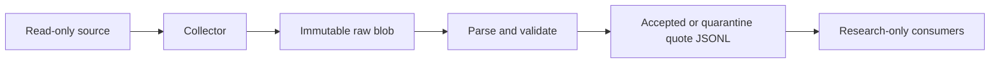
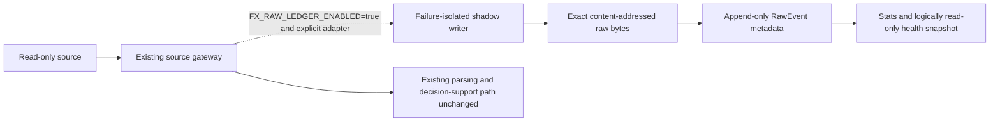

# Raw Ledger Phase 0–1 integration

Status: Phase 1 implementation and isolated acceptance validation complete; connected to the
read-only OANDA collector behind a default-off flag, but not enabled or deployed. Production
activation remains a separate host-bound approval. Completion evidence is recorded in
[`PHASE1_RAW_LEDGER_COMPLETION_20260802.md`](../audits/PHASE1_RAW_LEDGER_COMPLETION_20260802.md).
This document records
the local MacBook observation made on 2026-08-01. It is not evidence of the Mac mini runtime.
The Mac mini Phase 0 inventory was subsequently completed on 2026-08-02; its host evidence,
negative findings, and rollback artifact are recorded in
[`PHASE0_INVENTORY_FREEZE_20260802.md`](../audits/PHASE0_INVENTORY_FREEZE_20260802.md).

## Scope and safety translation

This increment adopts only Phase 0 and Phase 1 of
`FX_CODEX_TARGET_ARCHITECTURE_INTEGRATION_PLAN.md`. The repository remains permanently
analysis-only. The plan's OMS, broker adapter, order reconciliation, `CANCEL_ALL`, `REDUCE`,
`FLATTEN`, canary, paper, and live stages are not targets in this repository and must not be
implemented here. Later references to execution mean offline simulated fills only.

`FX_RAW_LEDGER_ENABLED` defaults to false. Enabling it is a separate, explicitly approved
deployment change after prospective capacity, permissions, backup, and freshness evidence.
The mode-600 collector environment parser accepts this flag but no other unrelated setting.
The adapter is connected only to the read-only OANDA pricing collector. It has no decision,
label, broker mutation, or notification authority. With the flag false it creates no ledger path
and leaves accepted/quarantine quote outputs unchanged.

## Phase 0 observation

- Repository: `/Users/takahashifuuki/Desktop/fx-codex`
- Branch: `codex/timeframe-counterfactual-contract`
- Observed HEAD: `4a59ba5`
- Worktree: dirty, with extensive tracked and untracked user changes predating this increment.
  No reset, migration, deployment, service restart, or journal rewrite was performed.
- Local launchd: only `com.fx-codex.dashboard-tunnel` was listed; no quote, snapshot, briefing,
  horizon, or health writer was observed on this MacBook.
- Local cron: absent. No FX/trading Docker container was observed.
- A pre-existing `.git/index.lock` dated 2026-07-29 exists. It was not removed.
- Secrets: `.env` exists outside tracked files; values were not read or printed. The tracked-file
  order-surface tests remain the authoritative structural check.
- Existing raw-first vertical slice: `data_platform.collect.raw_first` writes provider bytes to
  `ImmutableRawStore` before parsing and writes accepted/quarantined normalized quotes to JSONL.
  It is used by OANDA read-only pricing and Dukascopy historical collection.
- Existing authoritative/local stores include briefing JSONL journals, a virtual-portfolio
  SQLite store, quote-tape JSONL/index paths, PIT research artifacts, and run artifacts. These
  are not migrated by this increment.
- Local journal evidence is historical/stale and is not a production-health pass. The fusion
  journal audit found 34 rows, 8 duplicate rows (23.5%), two gaps, and no timestamp reversal.
  The timeframe journal found 544 rows, 8 duplicate rows (1.5%), multiple gaps, and no timestamp
  reversal. Historical duplicate rows are preserved.
- Baseline raw/collector test slice: 54 passed before this change.

This paragraph is the original pre-host-observation baseline. The later Phase 0 audit observed
the Mac mini process list, launchd topology, deployed SHA, paths, permissions, capacity, rescue
target, and freshness. Raw-ledger production activation remains blocked because it is a distinct
Phase 1 approval and the observed operational checkout is dirty and not a clean release
candidate.

## Data flow

Before this increment:

Available after this increment, but inactive while the flag is false:

The existing `ImmutableRawStore` write and hash verification complete before the shadow hook is
called. The hook queues RawEvent metadata before provider parsing. Parse/schema, stale,
out-of-order, and duplicate failures queue a post-ingest quarantine annotation behind that raw
event on the same FIFO worker.

`RawEvent` records event, publication, receive, and ingest clocks separately. Unknown source
clocks remain null; they are never inferred from local time. All supplied clocks are aware UTC.
Receipt must not be after declared ingestion, and `valid_from <= valid_to`. Source publication
or event clocks may be future/skewed and are retained first; domain quality checks occur only
after raw retention. The SHA-256 must match the exact payload bytes.

The ledger writes the payload blob before metadata. Metadata uses crash-atomic SQLite
transactions with update/delete-denying triggers. The same `event_id` with identical evidence is
idempotent; conflicting evidence fails closed. A distinct delivery equal to the current revision
head is retained with `duplicate_of`; changed bytes, including a reversion to an older payload,
supersede the current head. Post-ingest quarantine is a separate append-only annotation, so raw
receipt is never rewritten. `ledger_recorded_at` is a local process-observation lower bound
captured inside the append transaction; it is not an externally attested commit-completion time.
PIT consumers must use at least
`max(ingest_time, ledger_recorded_at)` as local availability and must not backdate availability to
event/publication time. Quarantine annotations separately store caller `annotated_at`, local
`ledger_recorded_at`, and their conservative maximum as `available_at`. This local evidence is
research/shadow only; strict promotion-grade availability still requires an independently
attested persistence protocol.

When a provider supplies `source_event_id`, its adapter must also provide a stable
`provenance.source_event_id_scope` describing the namespace in which that ID is unique (for
example provider endpoint + event type + instrument scope). Duplicate/revision matching uses
`source + source_event_id_scope + source_event_id`; IDs are never assumed globally unique.
OANDA pricing payloads do not include a sequence ID, so the adapter derives a scoped provider
identity from event type, instrument, and normalized provider event time. Delivery identity stays
separate and includes local connection/receipt evidence: a reconnect redelivery is retained as a
new raw delivery and annotated `duplicate_of`, while an exact replay of the same delivery is
idempotent. Payloads without a valid provider event time remain unkeyed rather than receiving a
fabricated source identity.
The source-identity scope also includes a SHA-256 account namespace so changing the configured
OANDA account cannot create a false cross-account duplicate/revision, while the account ID itself
is never written to the ledger.

## New interfaces and storage

- `data_platform.contracts.raw_event.RawEvent`: immutable raw delivery contract.
- `data_platform.raw.event_ledger.RawEventLedger`: transactionally append-only metadata,
  post-ingest quarantine annotations, health checks, and content-addressed blobs.
- `data_platform.raw.shadow.RawLedgerShadowWriter`: default-off adapter with a bounded,
  non-blocking queue and daemon worker. Lock/disk stalls cannot block the caller. Queue overflow
and worker errors increment failure metrics; the diagnostic log retains only a hashed event ID
  and error type. Metrics also expose worker liveness, queue backlog, and unfinished work; the
  worker contains thread-level termination exceptions so one malformed work item cannot strand
  later evidence. Queue overflow schedules a hashed diagnostic on a separate bounded daemon queue,
  keeping failure-log I/O off the collector hot path. Failure-log write errors are counters in the
  live metrics rather than swallowed as a successful diagnostic drain.
- `<root>/blobs/<sha-prefix>/<sha-suffix>`: exact raw bytes by default. An adapter may inject the
  existing `ImmutableRawStore` so the current raw-first collector does not duplicate blobs.
- `<root>/events.sqlite3`: WAL/FULL-synchronous local metadata and annotation ledger.
- `tools/raw_event_ledger_health.py`: read-only integrity, freshness, ratio, and required-symbol
coverage check. All operational thresholds are mandatory CLI inputs.
- `tools/raw_event_ledger_backup.py`: create-only online database snapshot plus referenced raw
  blobs, completion manifest, and full read-only restore verification.
- `tools/raw_ledger_activation_preflight.py`: host-bound fail-closed gate for permissions,
  OANDA-live-stream-only per-symbol freshness, counter-recomputed raw-loss metrics, explicit
  primary/backup retention capacity, event and annotation-complete backup, alert-route evidence,
  clock evidence, clean deployed SHA, and a pinned-key independent signature over every evidence
  binding. It never changes the feature flag or a service. A filesystem device-ID difference is
  necessary but insufficient; physical separation and independent retention are signed reviewer
  controls. Runtime counters must satisfy raw, annotation, and aggregate queue/storage arithmetic;
  per-symbol minimums are measured inside the signed trial window. Writer identity binds the
  process command, interpreter, installed `requests` transport closure and reviewed environment
  lock, isolated/no-site/no-bytecode-cache runtime flags, stable current-on-disk critical-code
  digest, exact loaded collector-env digest, start time,
  and actual flock. The wrapper ignores `PYTHONHOME`, `PYTHONPATH`, user-site, `.pth`,
  `sitecustomize`, and bytecode caches, then explicitly adds only the repository and reviewed venv
  site-packages. The production pricing `requests.Session` also disables environment-derived
  proxy, CA-bundle, and netrc configuration. Backup capacity uses the
  conservative full-snapshot series rather than treating snapshots as incremental. Backup
  completion is published only after the destination entry is durable, with the target-directory
  fsync as its commit point.

The critical-code digest is current on-disk deployment evidence; it is not a claim that mutable
Python process memory was independently measured. The preflight rejects code deployed after the
process started, and production activation additionally requires a sealed/read-only release so a
same-UID actor cannot swap and restore repository bytes. The collector-env digest is computed
from the exact stable bytes loaded by the process and must match current and signed preflight
evidence.

Trusted runtime files are opened with `O_NOFOLLOW`, checked for owner/mode safety, and bound to the
reviewed lock by content hash. On APFS/File Provider storage, a first read may materialize an
otherwise unchanged file and update its ctime. One unstable observation is therefore discarded
and reopened; the second read must be stable across device, inode, size, mtime, and ctime or the
collector fails closed. The bytes from that stable read must still match the reviewed environment
lock, so the retry does not authorize new content.
Required-symbol health accepts both provider-style (`USD_JPY`) and canonical (`USDJPY`) FX
labels and reports canonical keys. Each required symbol is checked against its own latest ingest
time; activity in one pair cannot make a stale target pair appear healthy.

When the shadow flag is enabled, the collector prepares the collection root as user-owned mode
`0700` before taking its writer lock or opening the network stream. The launchd installer also
sets a restrictive umask and narrows an existing collection root. Failure to establish this trust
boundary is a configuration failure, not a stream with silently failing ledger writes.
While the stream is running, a separate reporter atomically refreshes shadow metrics every five
seconds with observation time, run start, writer PID, queue backlog/liveness, overflow ratio, and
loss counters. Raw deliveries and post-parse annotations have separate attempted, failed, and
overflow ratios, so annotation traffic cannot dilute the measured raw-capture loss rate. Shutdown
writes a final/drained snapshot, so `status` does not present an undated prior-run counter file as
current evidence.
The ledger checks the complete lexical path for symlink ancestors even after validating the
nearest existing owner-only directory; a secure leaf cannot hide an indirect parent link.

Health exposes event count, unique payloads, duplicate/quarantine ratios, provenance coverage,
missing event-time count, latest ingest time, optional staleness, and caller-supplied ratio
thresholds. It verifies SQLite and raw-blob integrity by default. Missing thresholds are
`unknown`, never healthy. Required-symbol coverage can be checked explicitly; a missing symbol
degrades health. These metrics do not claim upstream completeness or source truth.
Stats and health use one WAL-aware SQLite read transaction, so all counts and integrity scans in a
report share one database snapshot. They never issue application-level writes, but SQLite may
create or manage its normal `-wal`/`-shm` sidecars while serving the read-only connection.

The SQLite triggers and per-record hashes detect normal application mistakes and accidental
corruption; they are not an external signature, object lock, or defense against a privileged
local attacker who can replace the database. External signed snapshots/backup evidence remain an
activation requirement. Because the daemon worker is intentionally isolated, process exit may
drop queued shadow metadata; the existing raw-first blob remains the source evidence. A separate
durable worker/service is required before treating this adapter as an authoritative collector.

## Activation gate and rollback

Before any activation, collect host-specific evidence for writer uniqueness, deployed SHA,
storage capacity, filesystem permissions, clock health, source coverage, expected event volume,
backup/restore, retention/legal constraints, and freshness alert routing. Run in shadow and prove
that existing outputs are unchanged. Activation must be a separate reviewed change.

Rollback is to remove the explicit caller adapter or set `FX_RAW_LEDGER_ENABLED=false`, then
restart only the read-only collection service under its normal operations procedure. This leaves
the immutable ledger intact for audit. Do not delete or rewrite blobs/events during rollback.

Risk-changing configuration (TP/SL, horizon, leverage, loss thresholds, label/net-R semantics,
calibration, temporal split, promotion thresholds) is untouched. Broker order surfaces remain
prohibited.
