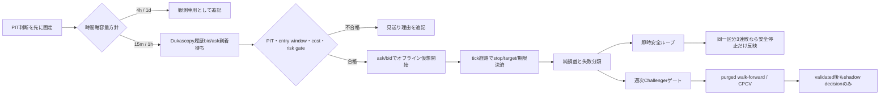

# 100万円仮想ポートフォリオと学習還流

## 目的と境界

この機能は、初期残高100万円を使う**オフライン模擬約定**の研究台帳である。
1日7万円は毎JST日の**必須運用タスク**として、確定純損益、残額、進捗、完了状態を
追跡する。ただし、利益や達成確率の保証、ポジション拡大条件、学習ラベル、最適化入力、
モデル昇格条件には使わない。主KPIは20 JST暦日の全コスト控除後
純R、1取引あたり期待値、その95% moving-block bootstrap区間、drawdown、成熟行数である。
サンプル不足時の区間は`insufficient_data`とし、記述統計をOOS性能主張には使わない。
ブローカー口座・注文・取消・決済APIへ接続するコードは
持たず、到達可能な最終段階はshadow decisionである。

`logs/fx_virtual_portfolio.sqlite3` は判断の初回取込、見送り、模擬開始、模擬終了、損益、
失敗分類を追記専用で保持する。書込みはプロセスロックを取得した1 writerだけが行い、
ダッシュボードはSQLite `query_only` 接続で読む。実行環境のSQLiteがWAL既知不具合の
修正版ではないため、この台帳は`FULL`同期のrollback journalを使う。

## 版管理されたリスク方針

schema v7では初期方針を`portfolio_config`に固定し、変更を
`portfolio_policy_updates`へ有効時刻・既知時刻・前方針hash付きで追記する。
過去の判断、再生、スナップショットには、その時点で既知だった方針をas-of参照する。
既存行の更新・削除は禁止し、同じ変更の再実行はno-opにする。

2026-07-31の承認変更は、損失・drawdown・容量の上限だけを5倍にする。
1取引リスク、必須タスク、PIT、bid/ask、コスト、鮮度、データ品質、安全学習の
fail-closed条件は増加・解除しない。

| 項目 | v1（変更前・履歴用） | v2（変更時刻以降） | 挙動 |
|---|---:|---:|---|
| 初期残高 | 1,000,000円 | 1,000,000円 | 初回ledger eventとして固定 |
| 必須運用タスク | +70,000円/日 | +70,000円/日 | 確定純損益で進捗・残額・完了を追跡。risk・学習・最適化には使わない |
| 1取引リスク | 残高の0.5% | 残高の0.5% | stop距離とJPY換算率からunitsを決定 |
| 日次損失上限 | 15,000円（1.5%） | 75,000円（7.5%） | 到達後は新規見送り |
| 週次損失上限 | 30,000円（3%） | 150,000円（15%） | 到達後は新規見送り |
| 月次損失上限 | 60,000円（6%） | 300,000円（30%） | 到達後は新規見送り |
| hard drawdown | 100,000円（10%） | 500,000円（50%） | 到達後は新規見送り |
| 同時保有 | 2件 | 10件 | 上限到達時は見送り |

必須タスクが未達でも、それを理由にunitsや上限を引き上げない。市場休場、古い判断、
PIT不成立、bid/ask欠落、JPY換算欠落、コスト欠落、データ・モデル・方針ハッシュ欠落は
すべて評価不能または見送りである。

## 時間軸と容量の分離

`virtual-horizon-allocation-v1`を固定し、0.5%の1取引riskと版管理された同時保有上限を
次のように分ける。

| 時間軸 | 分類 | 仮想ポジション枠 |
|---|---|---|
| 15m / 1h | `intraday_capacity` | 使用する |
| 4h / 1d | `observation_only` | 使用しない。判断と分類だけを追記する |
| その他 | `unsupported` | fail-closedで対象外 |

分類は`decision_horizon_assignments`へ方針hash付きで追記する。schema v4より前の終了判断は
`legacy_unassigned`として表示し、事後に推測して割り当てない。移行時点で残る4h/1d建玉は
削除・書換えせず、既存の日次決済要求で解消する。新しい4h/1d判断はquote、stop、target、
換算率を要求せず観測専用のterminal abstentionとなり、履歴気配待ちや保有枠を発生させない。

## 判断から学習まで



判断時には次を保存する。

- aware UTCの判断時刻、初回観測時刻、source cutoff、feature availability
- decision/input context/source recordの識別子
- symbol、timeframe、方向、stop、target、確信度
- 構造化features/components/warningsと、人間向けの理由
- data/model/policyのSHA-256
- quoteのevent/available/ingested時刻、bid/ask、revision、source record

判断を取り込む前にその後の価格経路は読まない。`decision_intakes`へ初回観測時刻と
判断本文を追記した後、後続サイクルが`collect/log/quotes.jsonl`を読む。Dukascopy行は
`provider=dukascopy`、`account_environment=datafeed`、
`source_endpoint_class=historical_datafeed`、`collection_mode=historical_download`、
`quality_state=usable`、raw payload SHA-256とaware timestampを全て満たす場合だけ使う。
これは**遅延履歴再生**であり、real-time quote、paper fill、broker executionではない。

判断後5分以内の最初のtickを仮想entryにする。longはask、shortはbidで開始し、
その後の正確なtick順でlongはbid、shortはaskを使ってstop/targetを判定する。
価格が水準を飛び越えた場合は最初の観測価格を使い、stop/targetへ有利に丸めない。
時間切れは判断時刻からtimeframe分の経路に含まれる最後のtickで終了する。

自由記述の「反省文」はモデル入力にしない。モデルへ渡せるのは、判断時点ですでに
利用可能だった構造化特徴だけである。

## 純損益と原因分解

円換算後の恒等式は次で固定する。

```text
net_pnl_jpy
= gross_market_pnl_jpy
- spread_quote_cost_jpy
- slippage_cost_jpy
- commission_jpy
- financing_jpy
- conversion_cost_jpy
```

`gross_market_pnl_jpy`はmid-to-mid、`spread_quote_cost_jpy`はmid損益と
direction別bid/ask実行損益の差である。したがってspreadを別途もう一度引かない。
longはask開始/bid終了、shortはbid開始/ask終了で計算する。非JPY quote pairは
時刻・source付きquote-to-JPY換算率が無ければ終了評価しない。
追加コストが0円の場合も、cost model ID・version・sourceと`costs_complete=true`を
明示しなければ終了評価しない。

自動履歴再生の`virtual-replay-cost-policy/v1`は計画リスクに対してslippage 0.02R、
commission 0.01R、開始24時間ごとのfinancing 0.01R、非JPY quoteのconversion
0.005Rを保守的仮定として控除する。spreadは実測bid/askから計算するため重複控除しない。
この仮定は実際のbroker fillやexecution qualityの証拠ではなく、cost stressを含む
後続検証までperformance claimには使えない。

各終了取引は`virtual-trade-counterfactual-v1`として、取引なし、同一時刻・同一数量の
反対方向、mid約定、1R正規化を機械的に比較する。これは因果効果ではない。
固定時間決済は実際の終了がtime exitの場合だけ利用可能とし、別Stop/Targetは事前登録済み
代替方針が無い限り`unavailable`にする。事後に都合のよい水準を選ばない。

失敗分類は観測事実と推論を分ける。

- `signal_model`: wrong direction、高確信度損失
- `execution_cost`: 市場損益は正だが全コスト後は負
- `risk_portfolio`: 日/週/月損失上限、drawdown、同時保有上限
- `exit_opportunity`: stop終了、MFE後の利益吐き出し
- `data_system`: PIT、鮮度、quote、hash、sourceの不成立

各分類には`virtual-failure-rules-v2`、証拠、確度、確度スコアを保存する。

## 二段階の学習

### 即時安全ループ

模擬終了後すぐに変えてよいのは安全側だけである。実現損失による日/週/月停止、
hard drawdown、stale、spread異常、データ欠損を反映する。同じ
`symbol/timeframe/direction`の成熟済み・全コスト後損益が3連敗なら、次の新規仮想建てを
停止する。将来結果や日次KPIは見ない。alpha重み、閾値、stop/target、ポジションリスクは
この高速ループで増加・変更しない。

### 週次Challenger

`tools/virtual_portfolio_learning.py` は成熟したPIT行を検査し、最低150件までは
`insufficient_data`で終了する。件数を満たしても自動昇格せず、次を必須とする。
入力契約`virtual-portfolio-learning-pit-v3`はbid/askのentry/exit、実現spread、
slippage、commission、financing、conversionを含む正準`net-r-v3`を必須とし、
`decision_horizon_assignments.allocation_class=intraday_capacity`だけを含む。
schema v4以前の未割当取引と長期観測は会計・observer証拠には残すが、
15m/1h Challengerの成熟件数、期待値、学習datasetには含めない。

1. 時系列順のtrain/tune/calibration/rolling test/rolling holdout
2. label intervalのpurgeと24時間embargo
3. purged walk-forwardとCPCV
4. 全trial、seed、hash、windowの保存
5. PBO、Deflated Sharpe、bootstrap不確実性、単純baseline比較
6. 1.5倍、2倍、3倍のcost stress
7. calibration・coverage・drift・incident証拠
8. 独立レビュー後もshadow decisionで比較

現行の第5分割は、データが増えるたび境界が動く
`rolling_development_holdout`であり、lockboxではない。固定final testと一回限りの
固定lockboxは、対象行ID・境界・dataset hash・アクセス方針を別途事前コミットするまで
`unavailable_no_fixed_*_commitment`として扱う。rolling test/holdoutの観測値を
昇格証拠へ格上げしない。

日次7万円、当日の残り目標、目標達成フラグは特徴量とlabelの双方から拒否する。

## 操作

初期化と日次サイクル:

```bash
.venv/bin/python tools/virtual_portfolio.py init
.venv/bin/python tools/virtual_portfolio.py set-five-x-limits
.venv/bin/python tools/virtual_portfolio.py cycle --close-session
```

`set-five-x-limits`はブローカーへ接続せず、正規SQLite台帳へv2方針を1件だけ追記する。
本番では全DB consumerを停止し、完全backupと復元リハーサル後に一度だけ実行する。
schema v7適用後に旧コードへ戻す場合はコードだけを戻さず、停止中にschema v6の完全backupも
同時復元する。

日次サイクルはOANDA週末時間を`America/New_York`で判定して状態を記録する。
判断自身が休場時刻なら見送りにするが、休場中でも既に固定済みの判断に対する
遅延履歴決済と学習は継続する。重複decision/tradeは
同一内容ならno-op、内容が変わればimmutable conflictである。

既定の履歴気配は`collect/log/quotes.jsonl`である。別パスを使う場合も同じ厳格な
収集契約を満たす必要がある。

```bash
.venv/bin/python tools/virtual_portfolio.py cycle \
  --quotes collect/log/quotes.jsonl --close-session
```

終了quoteを外部の検証済みread-only収集系から渡す場合:

```bash
.venv/bin/python tools/virtual_portfolio.py close --request-json close.json
```

学習ゲート:

```bash
.venv/bin/python tools/virtual_portfolio_learning.py
```

成果物は`runs/virtual_portfolio_learning/<run-id>/challenger_gate.json`、
`outcome_memory.json`、`validation_evidence.json`、`promotion_audit.json`、
`multi_axis_model.json`へ保存する。全ファイルを同一filesystem上のstaging directoryへ
`O_EXCL`で書き、各ファイルを`fsync`した後、SHA-256一覧を持つ`completion.json`を追加し、
directory renameで一括公開する。同じrun IDは上書きしない。
`validation_evidence.json`はrolling development test窓のblock bootstrap平均net Rと
1.0/1.5/2.0/3.0倍コストstressを診断として計算する。固定final testではないため、
これらを`promotion_audit.json`の期待値・区間・cost-stress合格値へ転記しない。
trial matrix、候補確率、全trial ledgerが無いPBO/DSR/CPCV/較正は`unavailable`のままにし、
昇格を閉じる。`eligible_for_candidate_training=true`は学習開始可を意味するだけで、
性能合格や昇格を意味しない。

`multi_axis_model.json`は次の8軸を一つのresearch-only候補へ統合する。

| 軸 | 学習上の役割 |
|---|---|
| コスト控除後の収益分布 | canonical `realized_net_r`の平均・p10/p50/p90予測head |
| 市場レジーム | 判断時点のsession/regimeカテゴリ特徴 |
| 流動性 | 判断時点bid/ask・spread・鮮度のproxy。dealer order flowとは呼ばない |
| マクロサプライズ | 初回公表actualと事前forecastの標準化差。改定値と未来のscaleを拒否 |
| クロスアセット関係 | PITのVIX、DXY、米金利・curve、COT状態 |
| 不確実性 | calibration専用窓のsplit-conformal補正、p10-p90幅・coverage・interval score |
| 執行品質 | 実現コスト/Rを補助教師にする。実現値は予測featureへ入れない |
| ポートフォリオリスク | 判断時刻とknowledge時刻を同一に固定した残高・DD・保有risk |

必須軸のtrain coverageが60%未満の場合は`insufficient_axis_coverage`にする。
軸内部の一部数値欠損は、trainだけで求めたmedianと明示的missing indicatorを使う。
calibration/test/holdoutの値で補完値や軸合格判定を学習しない。学習できた場合も
固定final testと固定lockboxは未設定のまま扱い、PBO/DSR/CPCV、cost stress、
依存構造を考慮した不確実性検証、独立レビューが完了するまでは
`model_usable_for_decisions=false`であり、通知判断や安全ゲートを変更しない。

マクロサプライズはactualの初回公表記録とは独立した、発表前forecastのPIT記録を必須とする。
標準化尺度もactual公表前に終了したtrain-only fit window、20件以上の構成release ID、
source record SHA-256を持ち、`fit_window_end <= ingested/first_seen <= available <
actual publication`を満たす場合だけ利用する。流動性は判断時bid/askからspread、
pips、bps、quote ageをlearner側で再計算して一致する値だけを入力し、出所未結合の
status/baseline値は入力しない。cross-asset、portfolio riskも
event/available/ingested/first-seenがpredictionを超えないこととsource/hashを検証する。
結果、実現損益、MFE/MAE、終了理由、実現コストは予測特徴の全階層から拒否する。
判断時の`execution_snapshot`も予測特徴には使わず、執行品質はcanonical attributionから
作る補助目的変数だけにする。

学習toolの入力は同一プロセスがcanonical SQLiteから直接exportした内部payloadに限定する。
判断時portfolio riskは取込時に台帳から再計算して呼出し側の値を拒否するが、任意の
serialized mappingと自己hashだけをcanonical lineageの独立証明とは扱わない。将来、
外部artifact import/replayを許可する場合はdecision/open/close/knowledge recordを
canonical DBへ再joinして全lineageを再計算するまでfail closedとする。

各`cycle`は`runs/virtual_portfolio/<JST日付>/<run-id>/cycle.json`へ、台帳照合を含む
create-only監査成果物を生成する。初期資金 + 終了取引純損益、cash ledger、表示残高の
差額が0円でなければ照合不合格である。

## 定期ワンショット

`com.fx-codex.virtual-portfolio`は5分ごとに`run_exclusive.py`配下でconsumerを1回だけ
実行する。`com.fx-codex.virtual-portfolio-close`は平日17:30 JSTに日次照合を行い、
完全な実行可能Bid/Askが無い建玉は推測決済せず`deferred_missing_mature_executable_quote`
とする。`com.fx-codex.virtual-portfolio-learning`は金曜18:00 JSTに検証成果物だけを生成する。
いずれも価格writer、無限ループ、broker/paper注文、モデル自動昇格を持たない。

日次決済要求は`session_close_requests.request_id`ごとに管理する。完了の唯一の根拠は
同じ`request_id`を参照する`session_close_completions`である。旧
`session_events(event_type=closed)`は互換表示であり、要求より前の同日イベントが後発要求を
完了扱いにしてはならない。要求後は決済完了まで、cutoff以降の新規仮想建てを停止する。
完了時刻はそこまでの建玉0件と台帳照合を封印する境界であり、それより後の判断は同じ
JST日付でも直ちに新規評価へ戻す。完了時刻以前の遅延判断は決済済み状態へ遡及して建てない。
要求が存在し、完了もpending状態も説明できない場合、または完了時刻以前にeffectiveな建玉が
残る場合は`session_close_lifecycle_error`としてfail-closedにする。完了後にeffectiveとなった
建玉は不整合ではない。schema v6以降では建玉と決済のknowledge clockを
`simulated_trade_open_observations`と`simulated_trade_close_observations`へappend-onlyで
保存する。遅延再生はreplay as-of、通常判断は取込時刻を`open_known_at`とし、それ以前の
snapshot・risk・session lifecycle・V2 valuationへ建玉を遡及表示しない。遅延決済も
観測時刻を`close_known_at`とし、それ以前へ決済、現金反映、容量解放を遡及表示しない。
`close_known_at`は`open_known_at`以後でなければならず、ghost closeをfail-closedにする。
V2 snapshotとrisk event headもeffective・observed・recorded knowledge cutoffを適用する。
schema v4以前の既存行は、event time・quote ingested time・保存済みcanonical observed
time・open known timeの最大値から保守的に追記移行する。
create-only日次レポートの取引・損益窓もcompletion時刻で封印する。完了後の再開取引や
遅れて終了分類されたobserver集計は既存artifactへ混ぜず、再試行時は既存自己hashと
canonical取引・会計部分を検証してから同じartifactを返す。

ダッシュボード:

```bash
.venv/bin/python tools/ai_learning_dashboard/server.py \
  --host 127.0.0.1 --port 8788 \
  --portfolio-db logs/fx_virtual_portfolio.sqlite3
```

公開側は`/api/state`へファイルパスを渡せない。サーバー起動時に固定したログと台帳を
read-onlyで表示する。仮想口座DBは`tools/virtual_portfolio_read_api.py`がloopback
`127.0.0.1:8771`でquery-only読取りし、8788はJSON bytesをproxyする。
重い総合学習状態の集計中も仮想口座を別の読取りプロセスから返す。
既存6画面の総合状態は`tools/dashboard_state_snapshot.py`が5分ごとに
`logs/dashboard_state_cache.json`へatomic生成し、`/api/state`は固定キャッシュだけを読む。

## 現時点の解釈

初期残高とKPIを表示できても、利益能力の証拠にはならない。PIT適格な模擬終了行、
現実的コスト、固定時系列外部検証、固定lockbox、PBO/DSRが揃うまで、
`performance_claim_status=evaluation_unavailable`を維持する。
